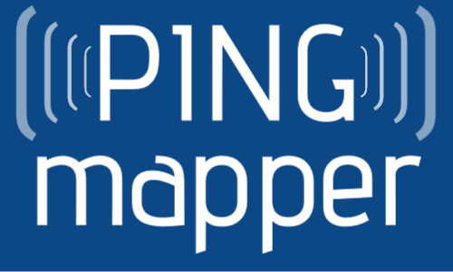

# PING-Mapper
[)](https://pypi.org/project/pingmapper/)
<!--  -->

## 

**Transform recordings from recreation-grade side scan sonar systems...**

*Video made with [HumViewer](https://humviewer.cm-johansen.dk/)*

**...into scientific datasets!**

# Overview

`PINGMapper` is an open-source Python interface for reading and processing side scan sonar datasets and reproducibly mapping benthic habitat features. `PINGMapper` transforms recreation-grade sonar systems (i.e. fishfinders) into scientific data collectors, allowing researchers and citizens alike to reproducibly map their aquatic system with minimal expertise in data processing.

## Learn More Now!
Check out PING-Mapper's [website](https://cameronbodine.github.io/PINGMapper/) for most up to date information:

- [Homepage](https://cameronbodine.github.io/PINGMapper/)
- [Getting Started](https://cameronbodine.github.io/PINGMapper/docs/gettingstarted)
- [Advanced Topics](https://cameronbodine.github.io/PINGMapper/docs/advanced)
- [Tutorials](https://cameronbodine.github.io/PINGMapper/docs/tutorials)
- [FAQ's](https://cameronbodine.github.io/PINGMapper/docs/faq.html)
- *and more!*

## Published Documentation
### v1.0.0 (August 29, 2022)
An overview of `PINGMapper` v1.0.0 functionality and justification are published in AGU's Earth and Space Science scientific journal.

#### Journal Article
Bodine, C. S., Buscombe, D., Best, R. J., Redner, J. A., & Kaeser, A. J. (2022). PING-Mapper: Open-source software for automated benthic imaging and mapping using recreation-grade sonar. Earth and Space Science, 9, e2022EA002469. [https://doi.org/10.1029/2022EA002469](https://doi.org/10.1029/2022EA002469)

#### Preprint

#### Code

### v2.0.0 (July 9, 2024)
A manuscript detailing the automated substrate mapping features made availabe in v2.0.0 is published in AGU's Journal of Geophysical Research: Machine Learning and Computation.

#### Journal Article
 Bodine, C. S., Buscombe, D., & Hocking, T. D. (2024). Automated river substrate mapping from sonar imagery with machine learning. Journal of Geophysical Research: Machine Learning and Computation, 1, e2024JH000135. [https://doi.org/10.1029/2024JH000135](https://doi.org/10.1029/2024JH000135) 

#### Preprint

#### Code

#### Segmentation models

#### Segmentation model training datasets

## Acknowledgements

### v1.0 - 2.0

*This study was originally made possible by a partnership between the U.S. Fish and Wildlife Service and Northern Arizona University. Funding for this work was provided by the Open Ocean Trustee Implementation Group to restore natural resources injured by the 2010 Deepwater Horizon oil spill in the Gulf of Mexico. The contents of this website are those of the authors and do not necessarily represent the views of the U.S. Fish and Wildlife Service or Northern Arizona University.*

**Primary Developer:** [Dr. Cameron S. Bodine](https://github.com/CameronBodine)

**Co-Developer:** [Dr. Daniel Buscombe](https://github.com/dbuscombe-usgs)

**Project Collaborators:** Thanks to Adam Kaeser (USFWS), Channing St. Aubin (USFWS), Mike Andres (USM), Kasea Price (USM), Alyssa Pagel (USM), Eric Haffey (USM), and Katherine Wright (USM).

**Advocates & Early-Adopters:** A special thanks to advocates and early-adoptors including, but not limited to, Jennylyn Redner, Adrian Pinchbeck, Art Trembanis, Dan Carlson, Alan Ryon, Mirko Denecke, Dan Haught, Dan Hamill, Mark Lundine, Elizabeth Greenheck, Hendra Kurnia Febriawan, Bryan Bozeman, Paul Grams, Matt Kaplinski, Jess Kozarek, Chris Milliren, Brett Connell and James Parham.

**PhD Committee:** Cameron wishes to thank his PhD dissertation committee: Toby Hocking, Co-Chair; advisor Dan Buscombe, Co-Chair; Rebecca Best; and Adam Kaeser.

### v3.0 - 4.0

Continued support for PINGMapper and tools in the [PING Ecosystem](./docs/PINGEcosystem.md) is made possible through mentorship, partnerships, and financial support listed below.

**Primary Developer:** [Dr. Cameron S. Bodine](https://github.com/CameronBodine)

**PostDoctoral Advisor:** [Dr. Arthur Trembanis](https://www.udel.edu/academics/colleges/ceoe/departments/smsp/faculty/arthur-trembanis/)

**Lab**: [Coastal Sediments, Hydrodynamics and Engineering Lab (CSHEL)](https://sites.udel.edu/ceoe-art/)

**Institution**: [College of Earth, Ocean, & Environment (CEOE)](https://www.udel.edu/ceoe/) at the [University of Delaware](https://www.udel.edu/)

**Advocates & Mentors**: Vincent Capone - [Black Laser Learning](https://blacklaserlearning.com/)

## Ready to get started?

Follow the installation and testing instructions to [Get Started!](https://cameronbodine.github.io/PINGMapper/docs/gettingstarted)

## Future Development, Collaborations, & Partnerships

If you are interested in partnering on future developments, please reach out to [Cameron Bodine](https://cameronbodine.github.io/).

# PING-Mapper is part of the Doodleverse!

The Doodleverse is an opinionated collection of Python packages designed for geoscientific image segmentation. Find out more on [GitHub](https://github.com/Doodleverse).

