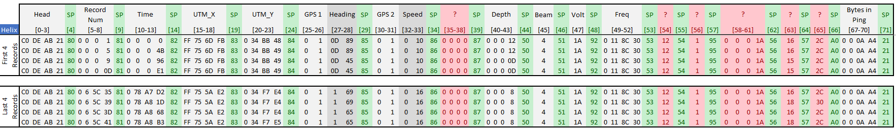

# Humminbird® Recording: DAT & SON Binary Structure
By Cameron S. Bodine

## 1) Introduction
PyHum [[1]](#1) [[2]](#2) is an open-source python framework for reading and processing recordings from a low-cost Humminbird® sidescan sonar system.  Developed for Python 2, it decodes Humminbird® DAT and SON files, exports the data, processes radiometric corrections, classifies bed texture, and produces maps.  Since its release, additional and enhanced functionality has been identified by the software authors and end-users, including Python 3 compatibility.  This can only be achieved with a complete understanding of the Humminbird® Recording binary structure.  This report documents new findings on the binary structure of Humminbird® sonar recordings, essential for processing and exporting raw sonar data (see [Humminbird® Recording: DAT/SON Processing & Raw Data Export](../docs/Processing&RawDataExport.md) for more information).

## 2) DAT and SON Binary Structure
The initial release of PyHum documented the [binary structure](https://github.com/dbuscombe-usgs/PyHum/blob/master/docs/data_formats.rst) of Humminbird® sonar files.  Using this as a guide, DAT and SON files were investigated using a program called [Hexinator](https://hexinator.com/).  Hexinator interface displays binary data in hexidecimal format.  Binary files are then annotated with known structures and elements, known as a grammer.  The grammer can be applied to any binary file which aides in identifying differences in the binary structure.  In the screenshot below, the left window shows the color coded hexidecimal characters on the left side with the binary ASCII values on the right.  The right window shows the grammer for the file, indicating Position, Offset, Length, Index, Name, and integer value of the hexidecimal character.

### 2.1) DAT File Structure
The DAT file contains metadata that applies to the sonar recording.  It includes information related water type specified on the sonar unit, the Unix date and time when the sonar recording began, geographic location where the recording began, name of the recording, number of sonar records, and length of the recording.  The size (in bytes) of the DAT file varies by Humminbird® model (and potentially firmware).  The following section indicate the offset from start of the DAT file, length (number of hexidecimal characters), and description of the data.

#### 2.1.1) Humminbird® 900/1100/Helix Series

| Name              | Offset | Length | Bytes | Hex Value     | Integer Value | Description |
| ----------------- | ------ | ------ | ----- | ------------- | ------------- | ----------- |
| DAT Beginning     | +0     | 1      | 8     | `C1`          | 193           | Beginning of DAT File |
| Water Type        | +1     | 1      | 8     | *Varies*      | *Varies*      | 0='fresh' (freshwater); 1='deep salt'; 2='shallow salt'; otherwise='unknown' |
| Unknown           | +2     | 1      | 8     | *Varies*      | *Varies*      | Unknown     |
| Unknown           | +3     | 1      | 8     | `01`          | 1             | Unknown     |
| Firmware Version (?) | +4  | 4      | 32    | *Varies*      | *Varies*      | Installed firmware version (?) |
| Unknown           | +8     | 4      | 32    | *Varies*      | *Varies*      | Unknown     |
| Unknown           | +12    | 4      | 32    | `00 00 00 00` | 0             | Unknown     |
| Unknown           | +16    | 4      | 32    | *Varies*      | *Varies*      | Unknown     |
| Unix Date/Time    | +20    | 4      | 32    | *Varies*      | *Varies*      | Recording start date and time |
| UTM X             | +24    | 4      | 32    | *Varies*      | *Varies*      | EPSG 3395 Easting |
| UTM Y             | +28    | 4      | 32    | *Varies*      | *Varies*      | EPSG 3395 Northing |
| Recording Name    | +32    | 4      | 32    | *Varies*      | *Varies*      | Recording name |
| Unknown           | +42    | 2      | 16    | *Varies*      | *Varies*      | Unknown     |
| Number of Records | +44    | 4      | 32    | *Varies*      | *Varies*      | Number of sonar records/pings |
| Length            | +48    | 4      | 32    | *Varies*      | *Varies*      | Length (in milliseconds) of sonar recording |
| Unknown           | +52    | 2      | 32    | *Varies*      | *Varies*      | Unknown     |
| Unknown           | +56    | 4      | 32    | `00 00 00 00` | 0             | Unknown     |
| DAT End           | +60    | 1      | 32    | *Varies*      | *Varies*      | End of DAT File |

#### 2.1.2) Humminbird® ONIX Series
The ONIX series has a different structure from other Humminbird&reg; models.  The first 48 bytes are in binary containing information about water type, number of pings in the recording, total time of recording, and ping size in bytes.  Following the binary header are ascii strings (human readable) containing additional information, with each piece of information encapsulated with `<attribute=value>`.  See tables below for more information.

**Binary Header**

| Name              | Offset | Length | Bytes | Hex Value     | Integer Value | Description |
| ----------------- | ------ | ------ | ----- | ------------- | ------------- | ----------- |
| DAT Beginning     | +0     | 1      | 8     | `C1`          | 193           | Beginning of DAT File |
| Water Type        | +1     | 1      | 8     | *Varies*      | *Varies*      | 0='fresh' (freshwater); 1='deep salt'; 2='shallow salt'; otherwise='unknown' |
| Unknown           | +2     | 1      | 8     | *Varies*      | *Varies*      | Unknown     |
| Unknown           | +3     | 1      | 8     | `00`          | 0             | Unknown     |
| Number of Pings   | +4     | 4      | 32    | *Varies*      | *Varies*      | Number of sonar records/pings |
| Length            | +8     | 4      | 32    | *Varies*      | *Varies*      | Length (in milliseconds) of sonar recording |
| Ping Size (Bytes) | +12    | 4      | 32    | *Varies*      | *Varies*      | Number of returns per ping |
| First Ping Period | +16    | 4      | 32    | *Varies*      | *Varies*      | First ping period (in milliseconds) |
| Beam Mask         | +20    | 4      | 32    | `1E 00 00 00` | 30            | Unknown     |
| Spacer            | +24    | 24     | 192   | `00`*24       | 0             | Spacer preceding ascii text |

**Ascii Text**

| Name              | Example              |
| ----------------- | ---------------------- |
| Version           | < Version=SonarRecordThumbVersion > |
| Number of Pings   | < NumberOfPings=11712 > |
| Total Time Ms     | < TotalTimeMs=143092 > |
| Ping Size Bytes   | < PingSizeBytes=1652 > |
| First Ping Period | < FirstPingPeriodMs=1 > |
| Beam Mask         | < BeamMask=30 > |
| Chirp 1 Start Freq | < Chirp1StartFrequency=0 > |
| Chirp 1 End Freq  | < Chirp1EndFrequency=0 > |
| Chirp 2 Start Freq | < Chirp2StartFrequency=0 > |
| Chirp 2 End Freq  | < Chirp2EndFrequency=0 > |
| Chirp 3 Start Freq | < Chirp3StartFrequency=0 > |
| Chirp 3 End Freq  | < Chirp3EndFrequency=0 > |
| Source Device Model ID 2D | < SourceDeviceModelId2D=1001 > |
| Source Device Model ID SI | < SourceDeviceModelIdSI=1001 > |
| Source Device Model ID DI | < SourceDeviceModelIdDI=1001 > |

#### 2.1.3) Humminbird&reg; Solix Series

| Name              | Offset | Length | Bytes | Hex Value     | Integer Value | Description |
| ----------------- | ------ | ------ | ----- | ------------- | ------------- | ----------- |
| DAT Beginning     | +0     | 1      | 8     | `C3`          | 195           | Beginning of DAT File |
| Water Type        | +1     | 1      | 8     | *Varies*      | *Varies*      | *Need's further investigation* |
| Unknown           | +2     | 1      | 8     | *Varies*      | *Varies*      | Unknown     |
| Unknown           | +3     | 1      | 8     | `01`          | 1             | Unknown     |
| Firmware Version (?) | +4  | 4      | 32    | *Varies*      | *Varies*      | Installed firmware version (?) |
| Unknown           | +8     | 4      | 32    | *Varies*      | *Varies*      | Unknown     |
| Unknown           | +12    | 4      | 32    | `00 00 00 00` | 0             | Unknown     |
| Unknown           | +16    | 4      | 32    | `00 00 00 00` | 0             | Unknown     |
| Unix Date/Time    | +20    | 4      | 32    | *Varies*      | *Varies*      | Recording start date and time |
| UTM X             | +24    | 4      | 32    | *Varies*      | *Varies*      | EPSG 3395 Easting |
| UTM Y             | +28    | 4      | 32    | *Varies*      | *Varies*      | EPSG 3395 Northing |
| Recording Name    | +32    | 4      | 32    | *Varies*      | *Varies*      | Recording name |
| Unknown           | +42    | 2      | 16    | *Varies*      | *Varies*      | Unknown     |
| Number of Records | +44    | 4      | 32    | *Varies*      | *Varies*      | Number of sonar records/pings |
| Length            | +48    | 4      | 32    | *Varies*      | *Varies*      | Length (in milliseconds) of sonar recording |
| Unknown           | +52    | 2      | 32    | *Varies*      | *Varies*      | Unknown |
| Unknown           | +56    | 4      | 32    | *Varies*      | *Varies*      | Unknown     |
| Unknown           | +60    | 4      | 32    | *Varies*      | *Varies*      | Unknown     |
| Unknown           | +64    | 4      | 32    | *Varies*      | *Varies*      | Unknown     |
| Unknown           | +68    | 4      | 32    | *Varies*      | *Varies*      | Unknown     |
| Unknown           | +72    | 4      | 32    | `00 00 00 00` | 0             | Unknown     |
| Unknown           | +76    | 4      | 32    | `D4 C3 B2 A1` | 2712847316    | Unknown     |
| Unknown           | +80    | 4      | 32    | `D4 C3 B2 A1` | 2712847316    | Unknown     |
| Unknown           | +84    | 4      | 32    | `D4 C3 B2 A1` | 2712847316    | Unknown     |
| Unknown           | +88    | 4      | 32    | `D4 C3 B2 A1` | 2712847316    | Unknown     |
| DAT End           | +60    | 1      | 32    | `D4 C3 B2 A1` | 2712847316    | End of DAT File |

### 2.2) SON File Structure
A SON file contains every sonar ping for a specific sonar channel.  File names correspond to the following sonar channels:

| File Name | Description                 | Frequency         |
| --------- | --------------------------- | ----------------- |
| B000.SON  | Down Scan Low Frequency     | 50/83 kHz         |
| B001.SON  | Down Scan High Frequency    | 200 kHz           |
| B002.SON  | Side Scan Port              | 455/800/1,200 kHz |
| B003.SON  | Side Scan Starboard         | 455/800/1,200 kHz |
| B004.SON  | Down Scan MEGA Frequency    | 1,200 kHz         |

Each SON file contains all the pings (ping returns) that were recorded.  Each ping begins with a header, containing metadata specific to that ping (see [Header Structure](#2211-Header-Structure) below).  The header is followed by 8-byte (0-255 Integer) values representing the returns for that ping.  All data stored in SON files are signed integer big endian.

#### 2.2.1) Ping Structure
The number of bytes for a ping varies in two ways.  First, the number of bytes in the ping header vary by model (and potentially firmware version), resulting in varying header length.  Second, the number of ping returns vary depending on the range setting on the unit.  The variability in the size of a ping across recordings and Humminbird&reg; models make automatic decoding of the file a non-trivial task.  Consistent structure between recordings and Humminbird&reg; models, however, has been identified.  

Each ping begins with the same four hexidecimal values: `C0 DE AB 21`.  This sequence is common to all sonar recordings encountered to date.  The header then terminates with the following hexidecimal sequence: `A0 ** ** ** ** 21` where the `** ** ** **` is a 32-byte unsigned integer indicating the number of sonar returns that are recorded immediately after `21`.  By counting the number of bytes beginning at `C0` and terminating at `21`, the correct header length can be determined.  Three different header lengths have been identified:

**Header Length by Model**

| Header Length | Humminbird Model |
| ------------- | ---------------- |
| 67 Bytes      | 9xx              |
| 72 Bytes      | 11xx, Helix, Onix|
| 152 Bytes     | Solix            |

##### 2.2.1.1) Header Structure
The header for a ping contains metadata specific to that ping.  Information about the ping location, time elapsed since beginning of the recording, heading, speed, depth, etc. are contained in this structure.  The data is preceded by a hexidecimal value that is unique for the data that follows, referred to as a tag.  For example, `Depth` is tagged by a hexidecimal value of `87`.  While the variety of information stored in the header varies by Humminbird&reg; model, tags consistently identify the type of information that follows.  The following sections indicate the tags, offset from start of a ping, the data that follows the tag, and the size (in bytes) of the data.

##### 2.2.1.2) Humminbird&reg; 900 Series
Header Length (Bytes): **67**

| Name              | Offset | Length | Bytes | Hex Value     | Integer Value | Description |
| ----------------- | ------ | ------ | ----- | ------------- | ------------- | ----------- |
| Header Start      | +0     | 4      | 32    | `A0 DE AB 21` | 3235818273    | Beginning of ping |
| Tag 80            | +4     | 1      | 8     | `80`          | 128           | - |
| **Record Number** | +5     | 4      | 32    | *Varies*      | *Varies*      | Unique ping ID |
| Tag 81            | +9     | 1      | 8     | `81`          | 129           | - |
| **Time Elapsed**  | +10    | 4      | 32    | *Varies*      | *Varies*      | Time elapsed (in milliseconds) |
| Tag 82            | +14    | 1      | 8     | `82`          | 130           | - |
| **UTM X**         | +15    | 4      | 32    | *Varies*      | *Varies*      | EPSG 3395 Easting |
| Tag 83            | +19    | 1      | 8     | `83`          | 131           | - |
| **UTM Y**         | +20    | 4      | 32    | *Varies*      | *Varies*      | EPSG 3395 Northing |
| Tag 84            | +24    | 1      | 8     | `84`          | 132           | - |
| **GPS Flag (?)**  | +25    | 2      | 16    | *Varies*      | *Varies*      | Quality flag for heading (?) 0=bad; 1=good |
| **Heading**       | +27    | 2      | 16    | *Varies*      | *Varies*      | Heading in tenths of a degree |
| Tag 85            | +29    | 1      | 8     | `85`          | 133           | - |
| **GPS Flag (?)**  | +30    | 2      | 16    | *Varies*      | *Varies*      | Quality flag for speed (?) 0=bad; 1=good |
| **Speed**         | +32    | 2      | 16    | *Varies*      | *Varies*      | Vessel speed in centimeters/second|
| Tag 87            | +34    | 1      | 8     | `87`          | 135           | - |
| **Depth**         | +35    | 4      | 32    | *Varies*      | *Varies*      | Sensor depth in centimeters |
| Tag 50            | +39    | 1      | 8     | `50`          | 80            | - |
| **Sonar Beam**    | +40    | 1      | 8     | *Varies*      | *Varies*      | 0=DS Low Freq; 1=DS High Freq; 2=SS Port; 3=SS Star |
| Tag 51            | +41    | 1      | 8     | `51`          | 81            | - |
| **Volt Scale**    | +42    | 1      | 8     | *Varies*      | *Varies*      | Voltage in tenths |
| Tag 92            | +43    | 1      | 8     | `92`          | 146           | - |
| **Frequency**     | +44    | 4      | 32    | *Varies*      | *Varies*      | Frequency in hertz |
| Tag 53            | +48    | 1      | 8     | `53`          | 83            | - |
| **Unknown**       | +49    | 1      | 8     | *Varies*      | *Varies*      | Unknown |
| Tag 54            | +50    | 1      | 8     | `54`          | 84            | - |
| **Unknown**       | +51    | 1      | 8     | *Varies*      | *Varies*      | Unknown |
| Tag 95            | +52    | 1      | 8     | `149`         | 149           | - |
| **Unknown**       | +53    | 4      | 32    | `00 00 00 1A` | 26            | Unknown |
| Tag 56            | +57    | 1      | 8     | `56`          | 86            | - |
| **+- UTM X (?)**  | +58    | 1      | 8     | *Varies*      | *Varies*      | Possibly +- UTM X in centimeters |
| Tag 57            | +59    | 1      | 8     | `57`          | 87            | - |
| **+- UTM Y (?)**  | +60    | 1      | 8     | *Varies*      | *Varies*      | Possibly +- UTM Y in centimeters |
| Tag A0            | +61    | 1      | 8     | `A0`          | 160           | - |
| **Bytes in Ping** | +62    | 4      | 32    | *Varies*      | *Varies*      | Number of bytes in ping returns |
| End Header        | +66    | 1      | 8     | `21`          | 33            | End of ping header |

##### 2.2.1.3) Humminbird&reg; 1100 & Helix Series
Header Length (Bytes): **72**  
*Note:* The structure is the same as 900 series for offset 0 - 33.

| Name              | Offset | Length | Bytes | Hex Value     | Integer Value | Description |
| ----------------- | ------ | ------ | ----- | ------------- | ------------- | ----------- |
| Header Start      | +0     | 4      | 32    | `A0 DE AB 21` | 3235818273    | Beginning of ping |
| Tag 80            | +4     | 1      | 8     | `80`          | 128           | - |
| **Record Number** | +5     | 4      | 32    | *Varies*      | *Varies*      | Unique ping ID |
| Tag 81            | +9     | 1      | 8     | `81`          | 129           | - |
| **Time Elapsed**  | +10    | 4      | 32    | *Varies*      | *Varies*      | Time elapsed (in milliseconds) |
| Tag 82            | +14    | 1      | 8     | `82`          | 130           | - |
| **UTM X**         | +15    | 4      | 32    | *Varies*      | *Varies*      | EPSG 3395 Easting |
| Tag 83            | +19    | 1      | 8     | `83`          | 131           | - |
| **UTM Y**         | +20    | 4      | 32    | *Varies*      | *Varies*      | EPSG 3395 Northing |
| Tag 84            | +24    | 1      | 8     | `84`          | 132           | - |
| **GPS Flag (?)**  | +25    | 2      | 16    | *Varies*      | *Varies*      | Quality flag for heading (?) 0=bad; 1=good |
| **Heading**       | +27    | 2      | 16    | *Varies*      | *Varies*      | Heading in tenths of a degree |
| Tag 85            | +29    | 1      | 8     | `85`          | 133           | - |
| **GPS Flag (?)**  | +30    | 2      | 16    | *Varies*      | *Varies*      | Quality flag for speed (?) 0=bad; 1=good |
| **Speed**         | +32    | 2      | 16    | *Varies*      | *Varies*      | Vessel speed in centimeters/second|
| Tag 86            | +34    | 1      | 8     | `86`          | 134           | - |
| **Unknown**       | +35    | 4      | 32    | `00 00 00 00` | 0             | Unknown |
| Tag 87            | +39    | 1      | 8     | `87`          | 135           | - |
| **Depth**         | +40    | 4      | 32    | *Varies*      | *Varies*      | Sensor depth in centimeters |
| Tag 50            | +44    | 1      | 8     | `50`          | 80            | - |
| **Sonar Beam**    | +45    | 1      | 8     | *Varies*      | *Varies*      | 0=DS Low Freq; 1=DS High Freq; 2=SS Port; 3=SS Star; 4=DS MEGA (if present) |
| Tag 51            | +46    | 1      | 8     | `51`          | 81            | - |
| **Volt Scale**    | +47    | 1      | 8     | *Varies*      | *Varies*      | Voltage in tenths |
| Tag 92            | +48    | 1      | 8     | `92`          | 146           | - |
| **Frequency**     | +49    | 4      | 32    | *Varies*      | *Varies*      | Frequency in hertz |
| Tag 53            | +53    | 1      | 8     | `53`          | 83            | - |
| **Unknown**       | +54    | 1      | 8     | *Varies*      | *Varies*      | Unknown |
| Tag 54            | +55    | 1      | 8     | `54`          | 84            | - |
| **Unknown**       | +56    | 1      | 8     | *Varies*      | *Varies*      | Unknown |
| Tag 95            | +57    | 1      | 8     | `95`          | 149           | - |
| **Unknown**       | +58    | 4      | 32    | `00 00 00 1A` | 26            | Unknown |
| Tag 56            | +62    | 1      | 8     | `56`          | 86            | - |
| **+- UTM X (?)**  | +63    | 1      | 8     | *Varies*      | *Varies*      | Possibly +- UTM X in centimeters |
| Tag 57            | +64    | 1      | 8     | `57`          | 87            | - |
| **+- UTM Y (?)**  | +65    | 1      | 8     | *Varies*      | *Varies*      | Possibly +- UTM Y in centimeters |
| Tag A0            | +66    | 1      | 8     | `A0`          | 160           | - |
| **Bytes in Ping** | +67    | 4      | 32    | *Varies*      | *Varies*      | Number of bytes in ping returns |
| End Header        | +71    | 1      | 8     | `21`          | 33            | End of ping header |

##### 2.2.1.4) Humminbird&reg; Solix Series
Header Length (Bytes): **152**  
*Note:* The structure is the same as 1100/Helix series for offset 0 - 43.

| Name              | Offset | Length | Bytes | Hex Value     | Integer Value | Description |
| ----------------- | ------ | ------ | ----- | ------------- | ------------- | ----------- |
| Head Start        | +0     | 4      | 32    | `A0 DE AB 21` | 3235818273    | Beginning of ping |
| Tag 80            | +4     | 1      | 8     | `80`          | 128           | - |
| **Record Number** | +5     | 4      | 32    | *Varies*      | *Varies*      | Unique ping ID |
| Tag 81            | +9     | 1      | 8     | `81`          | 129           | - |
| **Time Elapsed**  | +10    | 4      | 32    | *Varies*      | *Varies*      | Time elapsed (in milliseconds) |
| Tag 82            | +14    | 1      | 8     | `82`          | 130           | - |
| **UTM X**         | +15    | 4      | 32    | *Varies*      | *Varies*      | EPSG 3395 Easting |
| Tag 83            | +19    | 1      | 8     | `83`          | 131           | - |
| **UTM Y**         | +20    | 4      | 32    | *Varies*      | *Varies*      | EPSG 3395 Northing |
| Tag 84            | +24    | 1      | 8     | `84`          | 132           | - |
| **GPS Flag (?)**  | +25    | 2      | 16    | *Varies*      | *Varies*      | Quality flag for heading (?) 0=bad; 1=good |
| **Heading**       | +27    | 2      | 16    | *Varies*      | *Varies*      | Heading in tenths of a degree |
| Tag 85            | +29    | 1      | 8     | `85`          | 133           | - |
| **GPS Flag (?)**  | +30    | 2      | 16    | *Varies*      | *Varies*      | Quality flag for speed (?) 0=bad; 1=good |
| **Speed**         | +32    | 2      | 16    | *Varies*      | *Varies*      | Vessel speed in centimeters/second|
| Tag 86            | +34    | 1      | 8     | `86`          | 134           | - |
| **Unknown**       | +35    | 4      | 32    | `00 00 00 00` | 0             | Unknown |
| Tag 87            | +39    | 1      | 8     | `87`          | 135           | - |
| **Depth**         | +40    | 4      | 32    | *Varies*      | *Varies*      | Sensor depth in centimeters |
| Tag 88            | +44    | 1      | 8     | `88`          | 136           | - |
| **Unknown**       | +45    | 4      | 32    | `A1 B2 C3 D4` | 2712847316    | Unknown |
| Tag 89            | +49    | 1      | 8     | `89`          | 137           | - |
| **Unknown**       | +50    | 4      | 32    | `A1 B2 C3 D4` | 2712847316    | Unknown |
| Tag 8A            | +54    | 1      | 8     | `8A`          | 138           | - |
| **Unknown**       | +55    | 4      | 32    | `A1 B2 C3 D4` | 2712847316    | Unknown |
| Tag 8B            | +59    | 1      | 8     | `8B`          | 139           | - |
| **Unknown**       | +60    | 4      | 32    | `A1 B2 C3 D4` | 2712847316    | Unknown |
| Tag 8C            | +64    | 1      | 8     | `8C`          | 140           | - |
| **Unknown**       | +65    | 4      | 32    | `A1 B2 C3 D4` | 2712847316    | Unknown |
| Tag 8D            | +69    | 1      | 8     | `8D`          | 141           | - |
| **Unknown**       | +70    | 4      | 32    | `A1 B2 C3 D4` | 2712847316    | Unknown |
| Tag 8E            | +74    | 1      | 8     | `8E`          | 142           | - |
| **Unknown**       | +75    | 4      | 32    | `A1 B2 C3 D4` | 2712847316    | Unknown |
| Tag 8F            | +79    | 1      | 8     | `8F`          | 143           | - |
| **Unknown**       | +80    | 4      | 32    | `A1 B2 C3 D4` | 2712847316    | Unknown |
| Tag 50            | +84    | 1      | 8     | `50`          | 80            | - |
| **Sonar Beam**    | +85    | 1      | 8     | *Varies*      | *Varies*      | 0=DS Low Freq; 1=DS High Freq; 2=SS Port; 3=SS Star; 4=DS MEGA |
| Tag 51            | +86    | 1      | 8     | `51`          | 81            | - |
| **Volt Scale**    | +87    | 1      | 8     | *Varies*      | *Varies*      | Voltage in tenths |
| Tag 92            | +88    | 1      | 8     | `92`          | 146           | - |
| **Frequency**     | +89    | 4      | 32    | *Varies*      | *Varies*      | Frequency in hertz |
| Tag 53            | +93    | 1      | 8     | `53`          | 83            | - |
| **Unknown**       | +94    | 1      | 8     | *Varies*      | *Varies*      | Unknown |
| Tag 54            | +95    | 1      | 8     | `54`          | 84            | - |
| **Unknown**       | +96    | 1      | 8     | *Varies*      | *Varies*      | Unknown |
| Tag 95            | +97    | 1      | 8     | `95`          | 149           | - |
| **Unknown**       | +98    | 4      | 32    | `00 00 00 1A` | 26            | Unknown |
| Tag 56            | +102   | 1      | 8     | `56`          | 86            | - |
| **+- UTM X (?)**  | +103   | 1      | 8     | *Varies*      | *Varies*      | Possibly +- UTM X in centimeters |
| Tag 57            | +104   | 1      | 8     | `57`          | 87            | - |
| **+- UTM Y (?)**  | +105   | 1      | 8     | *Varies*      | *Varies*      | Possibly +- UTM Y in centimeters |
| Tag 98            | +106   | 1      | 8     | `98`          | 152           | - |
| **Unknown**       | +107   | 4      | 32    | `00 00 00 04` | 4             | Unknown |
| Tag 99            | +111   | 1      | 8     | `99`          | 153           | - |
| **Unknown**       | +112   | 4      | 32    | `00 00 00 4B` | 75            | Frequency Min |
| Tag 9A            | +116   | 1      | 8     | `9A`          | 154           | - |
| **Unknown**       | +117   | 4      | 32    | `00 00 00 5F` | 95            | Frequency Max|
| Tag 9B            | +121   | 1      | 8     | `9B`          | 155           | - |
| **Unknown**       | +122   | 4      | 32    | `00 00 00 0C` | 12            | Unknown |
| Tag 9C            | +126   | 1      | 8     | `9C`          | 156           | - |
| **Unknown**       | +127   | 4      | 32    | `A1 B2 C3 D4` | 2712847316    | Unknown |
| Tag 9D            | +131   | 1      | 8     | `9D`          | 157           | - |
| **Unknown**       | +132   | 4      | 32    | `A1 B2 C3 D4` | 2712847316    | Unknown |
| Tag 9E            | +136   | 1      | 8     | `9E`          | 158           | - |
| **Unknown**       | +137   | 4      | 32    | `A1 B2 C3 D4` | 2712847316    | Unknown |
| Tag 9F            | +141   | 1      | 8     | `9F`          | 159           | - |
| **Unknown**       | +142   | 4      | 32    | `A1 B2 C3 D4` | 2712847316    | Unknown |
| Tag A0            | +146   | 1      | 8     | `A0`          | 160           | - |
| **Bytes in Ping** | +147   | 4      | 32    | *Varies*      | *Varies*      | Number of bytes in ping returns |
| End Header        | +151   | 1      | 8     | `21`          | 33            | End of ping header |

Example of first and last 4 sonar records from sonar files.  Values displayed are in hexadecimal.

**1199**

**Helix**

## 3) References

<a id="1">[1]</a> Buscombe, D., Grams, P. E., & Smith, S. M. C. (2015). Automated Riverbed Sediment Classification Using Low-Cost Sidescan Sonar. Journal of Hydraulic Engineering, 142(2), 06015019. https://doi.org/10.1061/(ASCE)HY.1943-7900.0001079

<a id="2">[2]</a> Buscombe, D. (2017). Shallow water benthic imaging and substrate characterization using recreational-grade sidescan-sonar. Environmental Modelling and Software, 89, 1–18. https://doi.org/10.1016/j.envsoft.2016.12.003
