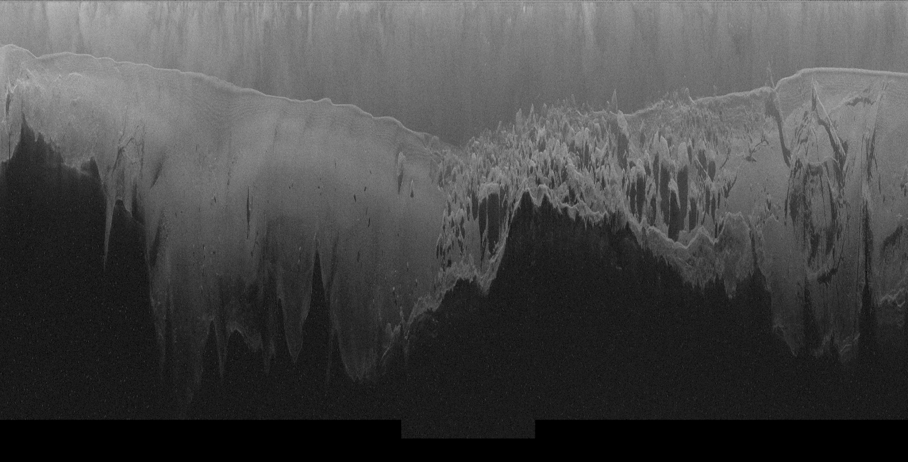
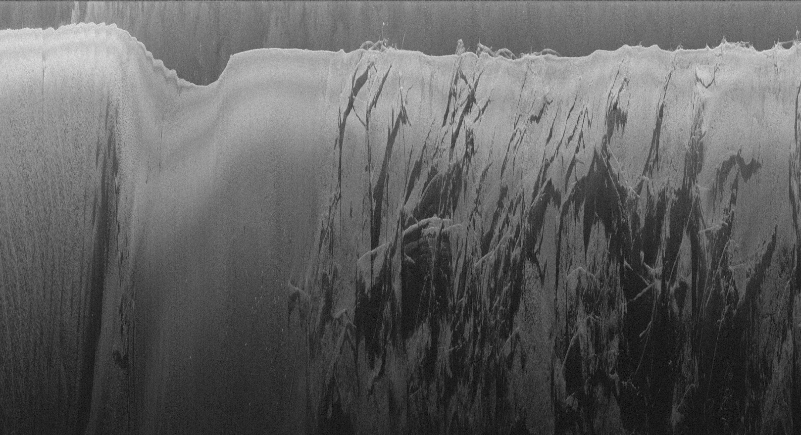

# Humminbird&reg; Recording: DAT/SON Processing & Raw Data Export
By Cameron S. Bodine

## 1) Introduction

This report documents new workflows for decoding Humminbird&reg; binary sonar recordings that will process recordings from any Humminbird&reg; model and firmware version (see [Humminbird&reg; Recording: DAT & SON Binary Structure](../docs/BinaryStructure.md) for more information).  The workflow includes procedures for loading DAT/SON files, exporting associated metadata, and exporting raw un-rectified imagery.  Once the DAT/SON files have been decoded, georectified sonar imagery can be generated (see [Humminbird&reg; Recording: Sonar Georectification](../docs/SonarGeorectification.md) for more information).

Two scripts, modeled after PyHum [[1]](#1) [[2]](#2), have been developed to read in and decode DAT and SON files, export ping metadata, and export un-rectified imagery of the sonar echogram.  The first script **pj_readFiles.py** handles the creation and manipulation of a `class sonObj()` instance. The `class sonObj()` is contained in **c_sonObj.py** which holds the attributes and functions for reading, decoding, and fetching data from DAT and SON files. These two scripts work in tandem to retrieve data from DAT and SON files.  **pj_readFiles.py** will be described to show how it interacts with the class.

## 2) Decode DAT File

The script **pj_readFiles.py** contains a single function `read_master_func()`, called from **main_single.py**.  The parameters passed to `read_master_func()` are as follows:

Parameters
----------
*sonFiles : str*
- SON file path

*humFile : str*
- DAT file path

*projDir : str*
- Project directory

*tempC : float [Default=0.1]*
- Water temperature (Celcius) / 10

*nchunk : int [Default=500]*
- Number of sonar records (pings) per chunk

Using the above parameters, a single `sonObj()` instance is generated called `son`.  The structure of the DAT file is determined by `son._getHumDatStruct()`.  The length of the DAT file, in bytes, is used to create a dictionary (`son.humDatStruct`) to store the byte index, offset from byte index where the data is stored, data length (in bytes), and data for each of the known and unknown elements in the DAT file.  For example, a recording generated from a 1100 series Humminbird&reg; will store the Unix date/time when the recording began at byte index `20`, with a `0` offset (DAT file attributes are not preceded by a tag, as is the case with SON files), with a length of `4` (32 bit integer).  See [DAT File Structure](../docs/BinaryStructure.md#21-DAT-File-Structure) for more information.  Once the DAT structure is determined, the contents of the DAT file are decoded and stored in `son.humDatStruct` by calling `son._getHumdat()`.  Using the `utm-e` and `utm-n` values store in the DAT file, the appropriate UTM zone is estimated and a translation from world coordinates to UTM coordinates is stored in the sonar object.  The decoded contents of the DAT file are stored in `projDir/meta/DAT_meta.csv`.

## 3) Decode SON Files
After DAT files are decoded and stored in the `son` object, a copy of the `son` object is created for each of the SON files found in `sonFiles` and stored in a list `sonObjs`.  Using the [SON File Structure](../docs/BinaryStructure.md#22-SON-File-Structure) as a guide, first the size (length in bytes) of the header of the first ping is determined using `son._cntHead()`.  The length of the header is used to determine the header structure using `son._getHeadStruct()`.  For sonar recordings tested to date, a ping will have a header of size 67, 72, or 152 based on Humminbird&reg; model (and potentially firmware version).  A given header size will have a specific header structure, which is stored in `son.headStruct`, a dictionary of lists indicating the attribute integer tag (i.e. record number==`128`, depth==`135`, etc.).  Each tag has a list indicating the byte index, offset from byte index where the data is stored, data length (in bytes), and a slot to store the data.

The `son.headStruct` is verified with `son._checkHeadStruct()` where a SON file is opened and checked to ensure each tag is found at the expected location in the ping header.  If `son.headStruct` is not accurate, then the SON file is searched to create an accurate `son.headStruct` with `son._decodeHeadStruct()`.  This ensures the decoding procedure does not fail with previously unseen Humminbird&reg; recordings.

Once an accurate ping header structure is found, each sonar channel's record header for each ping is decoded (in parallel) with `son._getSonMeta()` and saved to `projDir/meta/beamNumber_beamName_meta.csv`.  `son._getSonMeta()` uses the IDX file associated with a given sonar channel.  The IDX file contains the index location of the beginning of every ping, in addition to time elapsed (in milliseconds) since the recording began.  This facilitates seeking ping header data in an efficient way.  If the IDX file is missing, the function will automatically determine where each ping begins.  `son._getSonMeta()` also calculates the size, in meters, of a single ping based on the speed of sound in water using the `son._getPixSize()`.  This is used to calculate the [range extent](../docs/SonarGeorectification.md#4-Calculate-Range-Extent) of a ping.

## 4) Export Raw Sonar Tiles
After a sonar channel's metadata has been extracted, the sonar pings can be loaded and saved to a PNG.  The `nchunk` parameter dictates the number of pings to include in the exported sonar tile, and each ping is assigned a `chunk_id`.  First, the `son._getScansChunk()` function will open the sonar channel metadata in a Pandas dataframe.  The dataframe is subset by `chunk_id`, then the pings for a given chunk are loaded into memory using `son._loadSonChunk()`, and finally exported to PNG using `son._writeTiles()`.  Out-of-memory errors are avoided by only loading a given chunk at a time rather then loading the entire sonar recording into memory.

\

## 5) Save `son` Object
The final step of the procedure saves each `son` object to `projDir/meta/beamNumber_beamName_meta.meta`.  Saving the object to file allows easy reloading of the object's attributes for subsequent processing steps.

## 6) Conclusion
This report documented the procedures for decoding Humminbird&reg; [DAT/SON binary files](../docs/BinaryStructure.md), regardless of the Humminbird&reg; model or firmware version.  This workflow decodes and exports metadata from DAT and SON files, which is used to export un-rectified sonar tiles.  Any potential out-of-memory issues are avoided by only loading one chunk of pings into memory at a time.  These procedures have been designed to deal with unknown Humminbird&reg; sonar recording structures as well as potentially missing IDX files.  The next step is to produce georectified sonar imagery (see [Humminbird&reg; Recording: Sonar Georectification](../docs/SonarGeorectification.md) for more information).

## 7) References

<a id="1">[1]</a> Buscombe, D., Grams, P. E., & Smith, S. M. C. (2015). Automated Riverbed Sediment Classification Using Low-Cost Sidescan Sonar. Journal of Hydraulic Engineering, 142(2), 06015019. https://doi.org/10.1061/(ASCE)HY.1943-7900.0001079

<a id="2">[2]</a> Buscombe, D. (2017). Shallow water benthic imaging and substrate characterization using recreational-grade sidescan-sonar. Environmental Modelling and Software, 89, 1–18. https://doi.org/10.1016/j.envsoft.2016.12.003
