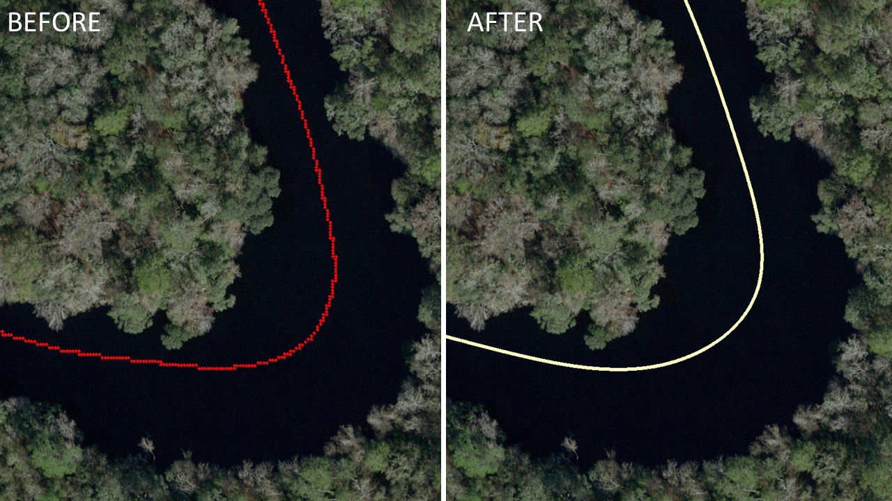
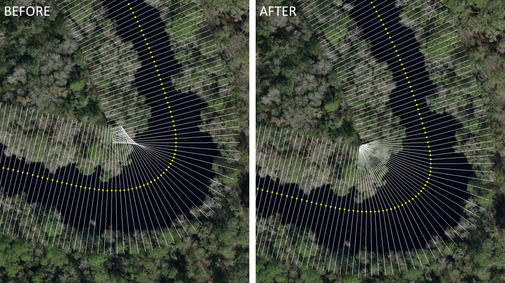
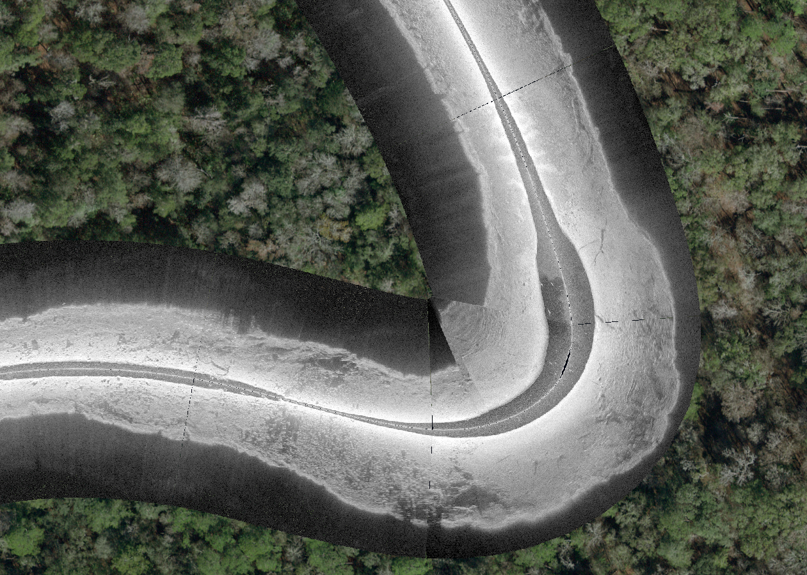

# Humminbird&reg; Recording: Sonar Georectification
By Cameron S. Bodine

## 1) Introduction
This document outlines the workflows for generating georectified side scan sonar imagery.  Georectification is the process of warping sonar tile pixel coordinates to geographic coordinates, enabling end-users to visualize sonar imagery in a GIS for further analysis.  This is the next step in the PING Mapper workflow, following [Humminbird&reg; Recording: DAT/SON Processing & Raw Data Export](../docs/Processing&RawDataExport.md).  

Three scripts handle the georectification procedure.  **c_rectObj.py** contains a new class called `class rectObj(sonObj)`.  This class is a child of `class sonObj()`, found in **c_sonObj.py**, giving `rectObj()` access to `sonObj()` attributes and functions.  **py_rectify.py** handles the creation and manipulation of the `rectObj()` instance.  

The workflow begins with loading a previously saved `sonObj` object and creating a new `rectObj()` instance.  A smoothed trackline is then fit to the sonar GPS track points and sonar records (pings) are interpolated along the smoothed trackline.  The port and starboard range extent for each chunk is calculated, following procedures from PyHum [[1]](#1) [[2]](#2).  Finally, previously exported un-rectified sonar tiles are warped and georectified, and a GeoTiff is exported for each chunk.

## 2) Load Sonar Object
The script **pj_rectify.py** contains a single function `rectify_master_func()`, called from **main_single.py**.  The parameters passed to `rectify_master_func()` are as follows:

Parameters
----------
*sonFiles : str*
- SON file path

*humFile : str*
- DAT file path

*projDir : str*
- Project directory

Each of the previously saved sonar objects (`projDir/meta/beamNumber_beamName_meta.meta`) are temporarily loaded and a new `rectObj()` is initialized.  All the attributes in the sonar object are loaded into `rectObj()`.  Each sonar channel now has it's own `rectObj()` instance and are stored in the list `rectObjs`.  The objects in `rectObjs` are interrogated to find the port and starboard channels, and are stored in a new list `portstar`.

## 3) Smooth Trackline
Modern Humminbird&reg; units have a built-in GPS to store the latitude and longitude for each ping.  Ports are available on the control head to connect to external GPS if desired.  Unless a survey grade GPS is used, the resulting trackpoints will exhibit a stepwise behavior, with multiple sonar records sharing the same geographic coordinates.  Ideally, the boat is constantly moving with smooth navigation and consistent speed during a sonar survey in order to generate optimal images of the bed [[3]](#3) (See [USFWS Sonar Tools and Training](https://www.fws.gov/panamacity/sonartools.html) for more information).  The raw trackpoints do not accurately reflect this, due to GPS uncertainty.  Therefore, additional processing of the trackpoints is needed to create a smooth trackline.

Most sonar surveys are carried out with a single transducer and therefore share the same GPS coordinates for all sonar channels.  A smoothed trackline is fit from a single side scan channel then copied to the other channel.  Previously saved sonar channel metadata (see [3) Decode SON files](../docs/Processing&RawDataExport.md#3-Decode_SON_Files)) is loaded to memory for one of `rectObj()` using `son._loadSonMeta()`.  Once loaded, a smoothed trackline is fit to the raw GPS coordinates with `son._interpTrack()`.  The function will filter the GPS points by taking every 50th ping, including first and last, fit a 3rd degree spline, then interpolate every ping along the resulting smoothed line.  Course over ground (COG) is calculated from the smoothed tracklines using `son._getBearing()`.  The smoothed coordinates and COG Pandas dataframe is saved to file (`/projDir/meta/Trackline_Smooth.csv`) and copied to the other side scan channel to determine a chunk's range extent.

### Example of Smoothed Trackline

## 4) Calculate Range Extent
The side scan range (in feet, meters, etc.) is set on the Humminbird&reg; control head prior and during a sonar recording.  This setting tells the unit how long to 'listen' for a ping return.  The range set on the Humminbird&reg; is not stored in the DAT or SON files.  PING Mapper estimates the range based on speed of sound in water to determine the size of a ping in meters (`pix_m`) (see [Decode SON Files](../docs/Processing&RawDataExport.md#3-Decode-SON-Files) for more information).  Range extent is calculated by multiplying `pix_m` by the number of ping returns in a ping.  Using the latitude, longitude and COG of the beginning of the ping (on the trackline), the geographic coordinates of the last return (range extent) are determined by `son._getRangeExtent()`.

## 5) Filter and Smooth Range Extent
Sonar surveys conducted on sinous systems require extra filtering and processing to ensure that pings do not overlap along bends (see image below).  Filtering is a necessary step for optimal georefrenced imagery.  `son._interpRangeCoords()` will first iterate through all pings to identify and remove overlapping pings with `son._checkPings()`.  The non-overlapping pings are then passed to `son._interpTrack()` to fit a one degree spline to the filtered points, then all pings are interpolated along the spline.  The result is a Pandas dataframe with the coordinates of the range extent with no overlap between pings.  The dataframe is saved to file (`/projDir/meta/RangeExtent_beam.csv`).

## 6) Georectification
After range extent has been calculated, [sonar tiles](../docs/Processing&RawDataExport.md#4-Export-Raw-Sonar-Tiles) are warped to the curvature of the trackline/range extent and pixel coordinates are converted to geographic coordinates.  This is accomplished with `son._rectSon()`.  Every 50th ping's trackline and range extent coordinates are used to facilitate processing speed.  A [Piecewise Affine Transform](https://scikit-image.org/docs/dev/api/skimage.transform.html?highlight=transform#piecewiseaffinetransform?raw=true "Scikit-Image Website") is used to transform the pixel coordinates to geographic coordinates, which then warps the image pixels to the curvature of the trackline/range extent.  The georectified image is saved as a GeoTiff.

Note that these images display the water column, which is not spatially accurate.  Removal of the water column will be discussed in subsequent documentation.

## 7) Conclusion
This report documented the georectification procedure for Humminbird&reg; sonar recordings.  The workflow included filtering and smoothing the vessel's trackline, calculating the range extent for every ping, and exporting a georectified sonar tile GeoTiff.  Subsequent documentation will outline procedures for accurately calculating the depth at nadir for water column removal and generating spatially accurate GeoTiff's.

## 8) References

<a id="1">[1]</a> Buscombe, D., Grams, P. E., & Smith, S. M. C. (2015). Automated Riverbed Sediment Classification Using Low-Cost Sidescan Sonar. Journal of Hydraulic Engineering, 142(2), 06015019. https://doi.org/10.1061/(ASCE)HY.1943-7900.0001079

<a id="2">[2]</a> Buscombe, D. (2017). Shallow water benthic imaging and substrate characterization using recreational-grade sidescan-sonar. Environmental Modelling and Software, 89, 1–18. https://doi.org/10.1016/j.envsoft.2016.12.003

<a id="3">[3]</a> Kaeser, A. J., & Litts, T. L. (2010). A Novel Technique for Mapping Habitat in Navigable Streams Using Low-cost Side Scan Sonar. Fisheries, 35(4), 163–174. https://doi.org/10.1577/1548-8446-35.4.163
