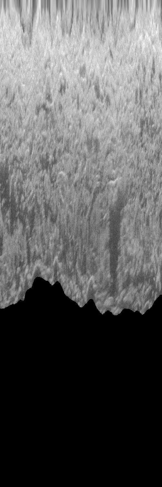

{: .no_toc }

<details open markdown="block">
  <summary>
    Table of contents
  </summary>
  {: .text-delta }
1. TOC
{:toc}
</details>

# Ping Attributes to CSV

PING-Mapper will locate each sonar ping's attributes for each available sonar channel. The attributes which PING-Mapper's developers have reverse-engineered are documented below. The attributes are written to CSV and saved in the `meta` folder in the project directory. By selecting `exportUnknown=True` in [`main.py`](https://github.com/CameronBodine/PINGMapper/blob/4b2446f38cde6a54551fcb8f8a4db1014d040077/main.py#L53), attributes which have not been reverse-engineered are also exported to CSV for review.

## record_num
{: .no_toc }
Unique ping identifier.

## time_s
{: .no_toc }
Time elapsed, in seconds, since the beginning of the sonar recording.

## utm_e
{: .no_toc }
Easting in meters (EPSG 3395).

## utm_n
{: .no_toc }
Northing in meters (EPSG 3395).

## gps1
{: .no_toc }
GPS quality flag for heading (?).
- 0==bad
- 1==good

## instr_heading
{: .no_toc }
Heading in tenths of a degree.

## gps2
{: .no_toc }
GPS quality flag for speed (?).
- 0==bad
- 1==good

## speed_ms
{: .no_toc }
Vessel speed from GPS in meters/second.

## inst_dep_m
{: .no_toc }
Sonar sensor depth estimate in meters.

## volt_scale (?)
{: .no_toc }
Voltage in tenths of a volt.

## f
{: .no_toc }
Sonar frequency in kHz.

## ping_cnt
{: .no_toc }
The number of returns for a given ping. Larger values proportional to larger range settings.

## index
{: .no_toc }
Byte offset for beginning of ping in the SON file.

## chunk_id
{: .no_toc }
The chunk that a given ping belongs to, as determined by the [`nchunk`](https://github.com/CameronBodine/PINGMapper/blob/4b2446f38cde6a54551fcb8f8a4db1014d040077/main.py#L52) setting.

## lon
{: .no_toc }
Longitude in WGS 1984.

## lat
{: .no_toc }
Latitude in WGS 1984.

## e
{: .no_toc }
Easting in recording's local UTM zone.

## n
{: .no_toc }
Northing in recording's local UTM zone.

## tempC
{: .no_toc }
Water temperature provided by [`tempC`](https://github.com/CameronBodine/PINGMapper/blob/4b2446f38cde6a54551fcb8f8a4db1014d040077/main.py#L51) parameter.

## pix_m
{: .no_toc }
Pixel size of a single ping return in meters.

## date
{: .no_toc }
Date of sonar recording.

## time
{: .no_toc }
Time of sonar ping.

## orig_record_num
{: .no_toc }
Sonar recordings will often have missing pings (see [Issue #33](https://github.com/CameronBodine/PINGMapper/issues/33)). There is an option for PING-Mapper to locate and flag missing data by setting [`fixNoDat`](https://github.com/CameronBodine/PINGMapper/blob/4b2446f38cde6a54551fcb8f8a4db1014d040077/main.py#L54) to `True`. This will insert a placeholder line in the ping attribute CSV using data from another ping, as identified by `orig_record_num`. If `record_num != orig_record_num`, then a missing ping has been identified. This information is used during sonogram image export to insert `NoData` in the appropriate location, ensuring ping's are properly geographically located.

## dep_m
{: .no_toc }
Final depth in meters. This value is based on the depth [detection method](#dep_m_method) used, whether depth estimates are [smoothed](dep_m_smth), and if any additional [pixel-wise adjustments](#dep_m_adjby) are made.

## dep_m_Method
{: .no_toc }
The method used to derive [`dep_m`](#dep_m), as given by the [`detect_dep`](https://github.com/CameronBodine/PINGMapper/blob/4b2446f38cde6a54551fcb8f8a4db1014d040077/main.py#L71-L72) parameter.

- 0=Use sonar sensor depth estimate
- 1=Use Residual U-Net model for depth estimate and water column segmentation (*Recommended*)
- 2=Use binary thresholding for depth estimate and water column segmentation

## dep_m_smth
{: .no_toc }
Option to smooth the depth estimates, as specified by [`smthDep`](https://github.com/CameronBodine/PINGMapper/blob/4b2446f38cde6a54551fcb8f8a4db1014d040077/main.py#L74).

## dep_m_adjBy
{: .no_toc }
Option to make additional pixel-wise adjustments to final depth estimate, as specified by [`adjDep`](https://github.com/CameronBodine/PINGMapper/blob/4b2446f38cde6a54551fcb8f8a4db1014d040077/main.py#L75).


# Sonogram Tiles
Export of non-rectified sonogram tiles is controlled with the [`wcp` and `wcr`](https://github.com/CameronBodine/PINGMapper/blob/4b2446f38cde6a54551fcb8f8a4db1014d040077/main.py#L60-L61) parameters. These exports are further controlled with [depth detection](https://github.com/CameronBodine/PINGMapper/blob/4b2446f38cde6a54551fcb8f8a4db1014d040077/main.py#L71-L72) and [shadow removal](https://github.com/CameronBodine/PINGMapper/blob/4b2446f38cde6a54551fcb8f8a4db1014d040077/main.py#L70) settings.

## Water Column Present
{: .no_toc }

```
wcp=True
remShadows=0
```


Shadows in the far-field can be segmented and removed by specifying `remShadows=2` (Remove shadows in far-field only). This model will improve with future software releases.

```
wcp=True
remShadows=2
```


## Water Column Removed
{: .no_toc }

The water column can be removed by setting `wcp=True` and selecting desired [detection method](#dep_m_method). Once the water column is removed, pixels are relocated using a flat bottom assumption.


```
wcr=True
detectDep=0
remShadows=0
```


Shadows in the far-field can be segmented and removed by specifying `remShadows=2`. This model will improve with future software releases.

```
wcr=True
detectDep=1
remShadows=2
```



# Bedpick Plots
Plots of the bedpick are exported to compare the sonar sensor depth estimate to the automated bedpicks.
```
detectDep = 1
pltBedPick = True
```


# Speed Corrected & Along-Track Stretched Sonogram

## Speed Corrected
{: .no_toc }

Speed corrected sonogram with water column and shadows present:
```
lbl_set = 1
spdCor = 1
maxCrop = True

remShadow = 0
detectDep = 0
```


Speed corrected sonogram with water column and shadows removed:
```
lbl_set = 2
spdCor = 1
maxCrop = True

remShadow = 2
detectDep = 1
```


## Along-Track Stretch
{: .no_toc }

Stretch factor of `0.75` with water column and shadows removed:
```
lbl_set = 2
spdCor = 0.75
maxCrop = True

remShadow = 2
detectDep = 1
```


Stretch factor of `10` with water column and shadows removed:
```
lbl_set = 2
spdCor = 10
maxCrop = True

remShadow = 2
detectDep = 1
```


# Georectified Mosaics
Sonograms can be georectified and mosaicked and brought into a GIS for additional analysis. Either the sonar sensor depth estimate or the automated depth estimates can be used for water column removal and slant range correction.

## Water Column Present
{: .no_toc }

Mosaics with the water column present can also be exported, however, these mosaics are not geographically correct due to the presence of the water column.

```
rect_wcp=True
```


## Water Column Removed
{: .no_toc }

The two panels show mosaics with water column removed. The left panel shows the mosaic with shadows removed in contrast to the right panel with shadows preserved.

```
# Left Panel

rect_wcr=True
detectDep=1
remShadow=2
mosaic=1
```

```
# Right Panel

rect_wcr=True
detectDep=1
remShadow=0
mosaic=1
```


