# Install PINGMapper
{: .no_toc }

Get `PINGMapper` up and running on your computer.
{: .fs-6 .fw-300 }

[](https://pypi.org/project/pingmapper/) [](https://pypi.org/project/pingwizard/) [](https://pypi.org/project/pingverter/) [](https://pypi.org/project/pinginstaller/)

---

{: .g2k }
> As of v4.0, the PINGMapper installation process has been dramatically improved and simplified compared to the [old version](./Installation-v1.md)

`PINGMapper` is a software (i.e. package) written in [Python](https://www.python.org/). PINGMapper uses a variety of Python packages ([NumPy](https://numpy.org/), [Pandas](https://pandas.pydata.org/), [Tensorflow](https://www.tensorflow.org/), etc.), or dependencies, that allow you to process Humminbird&reg; sonar recordings and generate a variety of GIS datasets.

{: .g2k }
> You **do not** need to know Python to use PINGMapper! After issuing a few simple commands, all interactions with PINGMapper will be point-and-click.

`PINGMapper` uses `conda` to ensure the installation is configured correctly. Specifically, `conda` is used to create a [virtual environment](https://conda.io/projects/conda/en/latest/user-guide/tasks/manage-environments.html#) called `ping`, a container storing the correct versions of the required dependencies so `PINGMapper` runs as expected.

`Conda` comes in several flavors, however, the recommended option for `PINGMapper` is [Miniforge](https://conda-forge.org/download/) because it is free for anyone to use.

 - [Miniforge](https://conda-forge.org/download/): *Free for all*; [License](https://github.com/conda-forge/miniforge?tab=License-1-ov-file#readme)

 {: .g2k }
 > Existing users may have previously used Miniconda or Anaconda. Due to licensing changes, it is recommended that you transition to Miniforge, an open-source alternative.

This tutorial demonstrates the recommended way to install and configure `PINGMapper`: install Miniforge, then run [PINGInstaller](https://github.com/CameronBodine/PINGInstaller), then use [PINGWizard](https://github.com/CameronBodine/PINGWizard) to launch and manage the software. `PINGInstaller` automatically creates the `ping` environment, installs the appropriate packages from the [PING Ecosystem](../PINGEcosystem.md) ([PINGMapper](https://github.com/CameronBodine/PINGMapper), [PINGWizard](https://github.com/CameronBodine/PINGWizard), [PINGVerter](https://github.com/CameronBodine/PINGVerter), etc.), and installs other necessary dependencies.

Let's get started!

## Step 1 - Install Miniforge

Go to the [Miniforge Website](https://conda-forge.org/download/) and download the software. Choose the appropriate installer for your computer's operation system. This tutorial was made on a Windows machine but the process should be similar on other operation systems. Click the file and it will download to your Downloads folder, or you can right-click and select "Save Link As..." and choose an alternative location to save the install file.

Double click the file to begin the installation file. This will open an installation window:

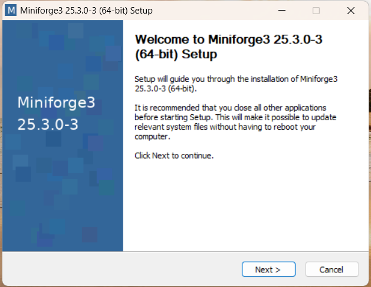

Click `Next` and you will see the license agreement:

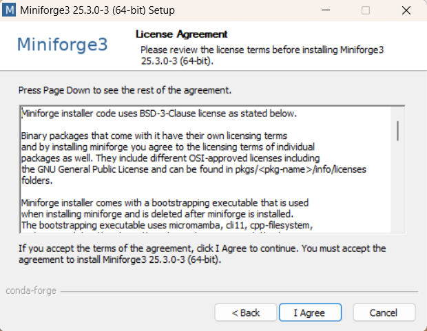

After reviewing the license agreement, you must select `I Agree` to continue with the installation. After you agree, you will have an option to install Miniforge for `Just Me` or `All Users`. 

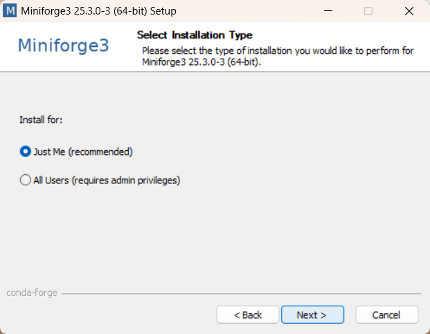

You want to install Miniforge in your user folder so that you have the necessary permissions to install the Python dependencies, so select `Just Me` and click `Next`.

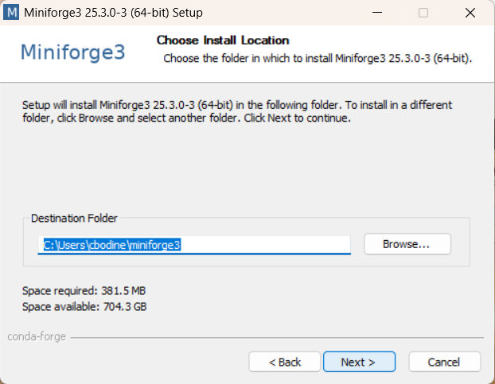

Accept the default installation location and click `Next`. This will open the Advanced Installation Options window. 

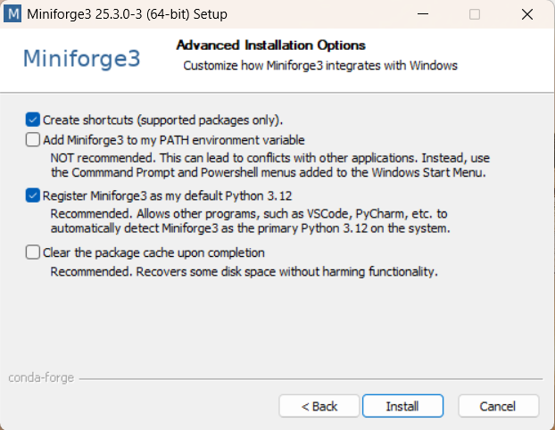

We will accept the default options, shown above, and click `Next`. Once installation is complete, you will see the following window indicating Miniforge was successfully installed:

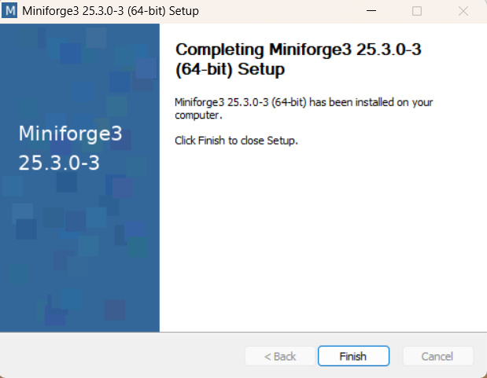

Click `Finish` to close the window.

## Step 2 - Open Miniforge Prompt

Next, open the Miniforge command prompt so you can run the installer commands. If you want to gain some familiarity with navigating with the prompt, you can watch this video:

<iframe width="560" height="315" src="https://www.youtube.com/embed/9zMWXD-xoxc" title="YouTube video player" frameborder="0" allow="accelerometer; autoplay; clipboard-write; encrypted-media; gyroscope; picture-in-picture; web-share" allowfullscreen></iframe>

On Windows, click the start button and scroll through your installed applications until you find `Miniforge Prompt`. 


Click the icon to open the prompt.

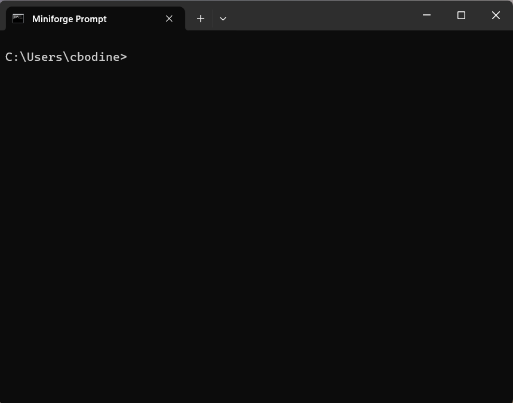

## Step 3 - Install PINGInstaller

{: .g2k }
> Installing PINGInstaller in the `base` environment will only download the PINGInstaller package and make no further changes.

[PINGInstaller](https://github.com/CameronBodine/PINGInstaller) is the recommended tool for installing and setting up `PINGMapper`. Install `PINGInstaller` with the following command and press `Enter`:

```bash
pip install pinginstaller -U
```

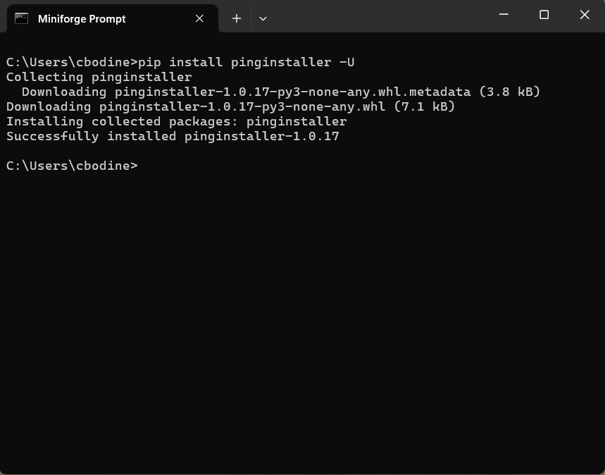

## Step 4 - Run PINGInstaller

By running `PINGInstaller`, a new conda environment called `ping` will be created, and the required dependencies for the PING ecosystem will be installed into `ping`. Add the following command and press `Enter`:

```bash
python -m pinginstaller
```

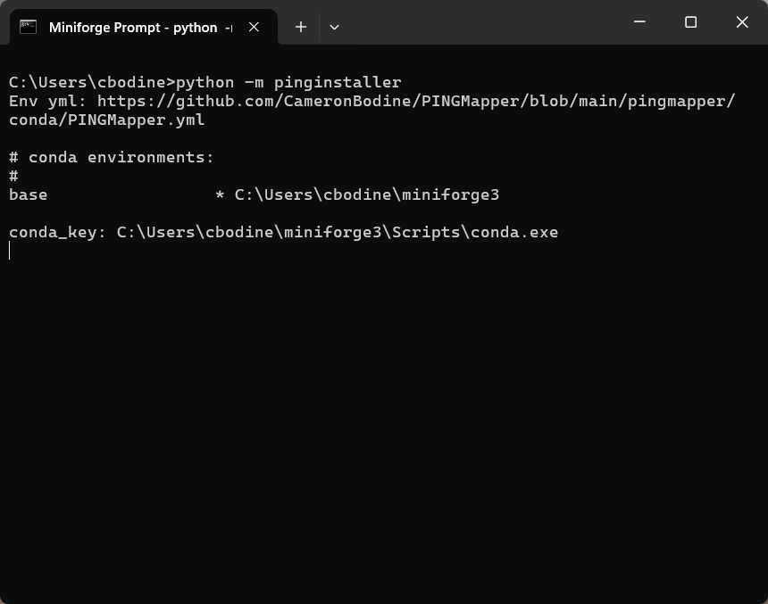

Installation will take approximately **5-10 minutes**. You should see something similar to:

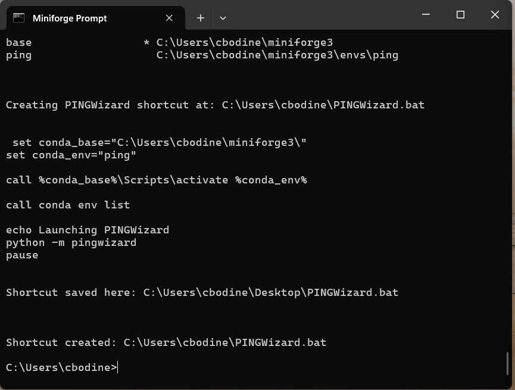

At the end of the install process, a window will prompt you where to save the `bat` or `sh` shortcut file used to launch `PINGWizard`. Browse to the desired location and click `Submit`.

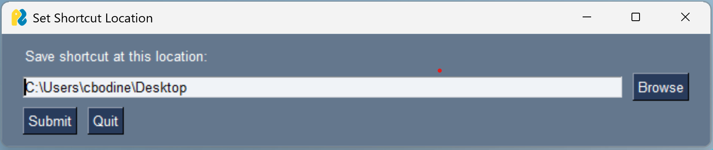


## That's It!

PINGMapper is now ready to go. The recommended next step is to [launch PINGWizard](./PINGWizard.md), the point-and-click interface for testing, updating, and processing data with `PINGMapper`.
