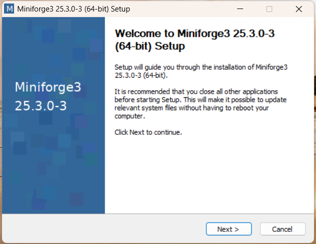
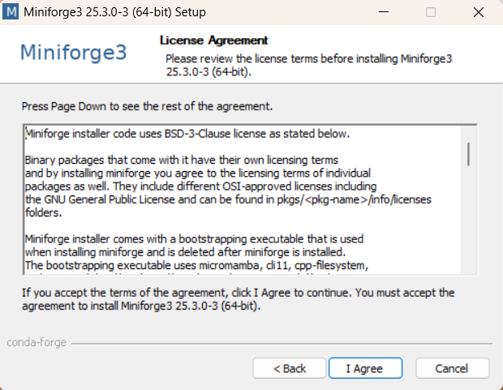

# Installation Instructions

{: .g2k }
> As of v4.0, the PINGMapper installation process has been dramatically improved and simplified compared to the [old version](./Installation-v1.md)

Here is a set of installation instructions to help you get up and running with PINGMapper. Screenshots and additional detail are provided to aid navigating this somewhat cumbersome installation procedure.

PINGMapper is a software (i.e. package) written in [Python](https://www.python.org/). PINGMapper uses a variety of Python packages ([NumPy](https://numpy.org/), [Pandas](https://pandas.pydata.org/), [Tensorflow](https://www.tensorflow.org/), etc.), or dependencies, that allow you to process Humminbird&reg; sonar recordings and generate a variety of GIS datasets. To ensure that all the dependencies are configured correctly, we will first install a software called [Miniconda](https://docs.conda.io/en/latest/miniconda.html), the lightweight version of [Anaconda](https://www.anaconda.com/). Miniconda allows you to create [virtual environments](https://conda.io/projects/conda/en/latest/user-guide/tasks/manage-environments.html#) which are containers storing all the correct versions of the dependencies required to run Python software packages, ensuring everything runs as expected.

{: .warning }
> Miniconda and Anaconda are not free for everyone to use. Consider installing [Miniforge](https://conda-forge.org/download/) instead.

After installing Miniconda, we will procede with downloading the [latest version of PINGMapper](https://github.com/CameronBodine/PINGMapper) hosted on [GitHub](https://github.com/). Then, we will create a virtual environment called `ping` and install all the required dependencies to run PINGMapper.

Let's get started!

## Step 1 - Install Miniconda

[Click this](https://www.anaconda.com/download/) to open a web browser and navigate to the Miniconda download page.

There is a seperate installation file depending on the type of computer you are using. This tutorial was made on a Windows machine but the process should be similar on other operation systems. Click the file and it will download to your Downloads folder, or you can right-click and select "Save Link As..." and choose an alternative location to save the install file.

Double click the file to begin the installation file. This will open an installation window:



Click `Next` and you will see the license agreement:



After reviewing the license agreement, you must select `I Agree` to continue with the installation. After you agree, you will have an option to install Miniconda for `Just Me` or `All Users`. 


You want to install Miniconda in your user folder so that you have the necessary permissions to install the Python dependencies, so select `Just Me` and click `Next`.


Accept the default installation location and click `Next`. This will open the Advanced Installation Options window. 


We will accept the default options, shown above, and click `Next`. Once installation is complete, you will see the following window indicating Miniconda was successfully installed:


You can choose to see additional documentation on conda and Anaconda by keeping the the boxes checked. Click `Finish` to close the window.

## Step 2

Now for the scary part! We are going to open a command prompt so that we can submit a series of commands to Miniconda. At this time, the prompt is the primary interface for installing and running PINGMapper. If you want to gain some familiarity with navigating with the prompt, you can watch this video:

<iframe width="560" height="315" src="https://www.youtube.com/embed/9zMWXD-xoxc" title="YouTube video player" frameborder="0" allow="accelerometer; autoplay; clipboard-write; encrypted-media; gyroscope; picture-in-picture; web-share" allowfullscreen></iframe>

Miniconda includes a command prompt called Anaconda Powershell Prompt that we will use to install and run PINGMapper. On Windows, click the start button and scroll through your installed applications until you find the `Miniconda3` or `Anaconda (miniconda3)` folder. 


Click the folder are click `Anaconda Powershell Prompt`. This will open the prompt.


## Step 2

A package called [PINGInstaller](https://github.com/CameronBodine/PINGInstaller) is used to install and setup PINGMapper. We will install PINGInstaller with the following command and pressing `Enter`:

```bash
pip install pinginstaller
```


## Step 3

Now run PINGInstaller to download and install all dependencies into a conda environment. Add the following command and press `Enter`:

```bash
python -m pinginstaller
```


Installation will take approximately **5-10 minutes**. You should see something similar to:


## That's It!

PINGMapper is now ready to go. [Launch PINGWizard](./Running.md), a new interface for PINGMapper, to start processing data.


