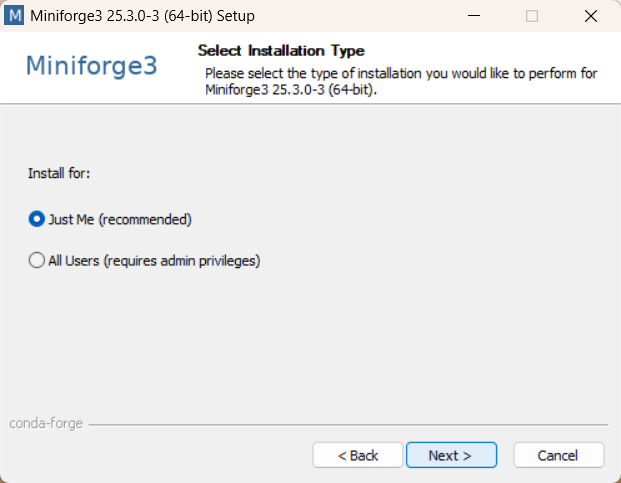
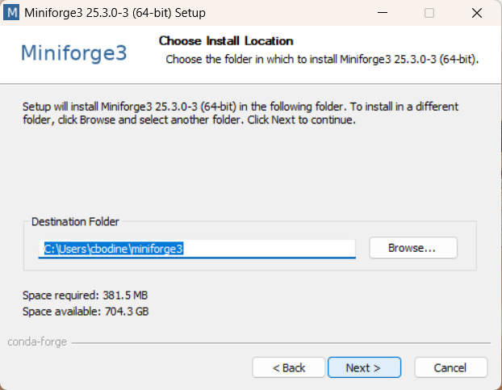

# Detailed Installation Instructions

Here is a set of installation instructions to help you get up and running with PINGMapper. Screenshots and additional detail are provided to aid navigating this somewhat cumbersome installation procedure.

PINGMapper is a software (i.e. package) written in [Python](https://www.python.org/). PINGMapper uses a variety of Python packages ([NumPy](https://numpy.org/), [Pandas](https://pandas.pydata.org/), [Tensorflow](https://www.tensorflow.org/), etc.), or dependencies, that allow you to process Humminbird&reg sonar recordings and generate a variety of GIS datasets. To ensure that all the dependencies are configured correctly, we will first install a software called [Miniconda](https://docs.conda.io/en/latest/miniconda.html), the lightweight version of [Anaconda](https://www.anaconda.com/). Miniconda allows you to create [virtual environments](https://conda.io/projects/conda/en/latest/user-guide/tasks/manage-environments.html#) which are containers storing all the correct versions of the dependencies required to run Python software packages, ensuring everything runs as expected.

After installing Miniconda, we will procede with downloading the [latest version of PINGMapper](https://github.com/CameronBodine/PINGMapper) hosted on [GitHub](https://github.com/). Then, we will create a virtual environment called `ping` and install all the required dependencies to run PINGMapper.

Let's get started!

## Step 1 - Install Miniconda

[Click this](https://docs.conda.io/projects/miniconda/en/latest/) to open a web browser and navigate to the [Miniconda](https://docs.conda.io/en/latest/miniconda.html) download page.


There is a seperate installation file depending on the type of computer you are using. For this tutorial, we will use the Windows installation. Click the file and it will download to your Downloads folder, or you can right-click and select "Save Link As..." and choose an alternative location to save the install file.

Double click the file to begin the installation file. This will open an installation window:


Click `Next` and you will see the license agreement:


After reviewing the license agreement, you must select `I Agree` to continue with the installation. After you agree, you will have an option to install Miniconda for `Just Me` or `All Users`. 



You want to install Miniconda in your user folder so that you have the necessary permissions to install the Python dependencies, so select `Just Me` and click `Next`.



Accept the default installation location and click `Next`. This will open the Advanced Installation Options window. 


We will accept the default options, shown above, and click `Next`. Once installation is complete, you will see the following window indicating Miniconda was successfully installed:


You can choose to see additional documentation on conda and Anaconda by keeping the the boxes checked. Click `Finish` to close the window.

## Step 2

Now for the scary part! We are going to open a console so that we can submit a series of commands to Miniconda. At this time, the console is the primary interface for installing and running PINGMapper. If you want to gain some familiarity with issueing console commands, you can watch this video:

<iframe width="560" height="315" src="https://www.youtube.com/embed/9zMWXD-xoxc" title="YouTube video player" frameborder="0" allow="accelerometer; autoplay; clipboard-write; encrypted-media; gyroscope; picture-in-picture; web-share" allowfullscreen></iframe>

Miniconda includes a console called Anaconda Powershell Prompt that we will use to install and run PINGMapper. On Windows, click the start button and scroll through your installed applications until you find the `Miniconda3 folder`. 


Click the folder are click `Anaconda Powershell Prompt`. This will open the prompt.


What are we seeing here? First we see the word `(base)`. The word that is in the parentheses tells us the name of the virtual environment that is currently activated. The `base` environment is activated by default. After we install PINGMapper, we will need to activate the `ping` environment, but more on that later. Next we see `PS` which I assume means `Power Shell`, but I'm not certain. Next, we can see what drive and folder the prompt is currently pointed to. In the case of the image above, the prompt is opened in the base of the `C` drive, as indicated with `C:\`. It may be possible that your prompt opened in your user folder, which might look like `C:\Users\Cam`. The key here is that whatever this path says, that is directory where the prompt is currently pointed to, and subsequently, where PINGMapper will be installed.

We need to change to a directory where we have permission to edit files, so lets first navigate to the user folder using the `cd` (i.e., change directory) command. We can begin to type the word `us` and use the `tab` key on the keyboard to autocomplete (keep clicking tab to cycle through all folders in the current directory which begin with `us`) to see `.\Users\` and `Enter` or `Return` on the keyboard. Now we can see that we are in the directory `C:\Users` folder.


Now you want to go into your user folder by again issuing the `cd` command and beginning to type your username. My username on this computer is `csb67` so I start by typing `cd c` then click tab until I see `.\csb67` and hit `Enter` to step into the `C:\Users\csb67` directory.


Now I am in a directory that I control and can make edits to. This is the location where your `Documents`, `Pictures`, etc. folders are located (if you are on Windows). Let's use the prompt to make a new folder, or directory, called `PythonPackages` (or whatever you like) to store PINGMapper and any other Python packages you may use in the future. Issue the following command to do so:

```
mkdir PythonPackages
```


Now lets move the prompt into that new folder with:

```
cd PythonPackages
```


{: .g2k }
> If you accidently moved into the wrong folder, you can use `cd ..` to move back one folder from the current location:
> 
> Then type the directory you want to go into `cd PythonPackages`:
> 

Now we are in a location where we can install PINGMapper, but we want to do something else first!

## Step 3

Even though we just installed Miniconda, we want to make sure it is up-to-date with the latest packages. We can do this by running the following and hitting `Enter`:

```
conda update -n base conda
```


Miniconda will search for all the necessary updates and will ask if you want to proceed:


Hit `Enter` to accept the default answer of `yes` as indicated by a `y` in brackets `[y]`, and the updates will be downloaded and installed. Once complete, you will see the following screen waiting for the next command:


## Step 4

Miniconda has an environment solver that is built-in which it uses to make sure that the appropriate versions of package dependencies are correctly installed. It works (usually), but is pretty slow. Conda has released a new environment solver called [libmamba](https://www.anaconda.com/blog/a-faster-conda-for-a-growing-community) that is _considerably_ faster then installing environments with the classic installer. Install `libmamba` with:

```
conda install -n base conda-libmamba-solver
```


Hit `Enter` and Miniconda will download the necessary packages and ask if you want to proceed with installation.


Hit `Enter` to proceed. After succcessfully install `libmamba`, you will see the following:


To set `libmamba` as the default solver, submit the following and hit `Enter`:

```
conda config --set solver libmamba
```


{: .g2k }
> You can revert to the classic installer by running:
> ```
> conda config --set solver classic
> `

## Step 5

You shouldn't need to do this, but just in case, make sure that you have `git` installed by running the following, hitting `Enter`, and accepting by hitting `Enter` again:

```
conda install git
```

## Step 6

Great! Now we have Miniconda installed, we have installed `libmamba` to speed up installing package dependencies, and the prompt is located in the directory where we want to install PINGMapper (e.g., `C:\Users\Cam\PythonPackages`) as indicated in the prompt. Now we can download the latest version of PINGMapper by cloning the GitHub repository. We do that by issuing the following command and hitting `Enter`:

```
git clone --depth 1 https://github.com/CameronBodine/PINGMapper
```


We have now downloaded all the necessary scripts to run PINGMapper.

## Step 7

Now we need to move the prompt into the new PINGMapper directory by issuing the following command and hitting `Enter`:

```
cd PINGMapper
```


{: .g2k }
> The prompt must always be pointing to the PINGMapper directory in order to use the software. Use the `cd` command to navigate to the PINGMapper folder evertime you start a session.

## Step 8

Now we are going to install all the necessary packages that PINGMapper depends on in order to run. We will create a virtual environment called `ping` and install all the packages that are listed in a file that was downloaded from the repository. We do this by running the following command and hitting `Enter`:

```
conda env create --file conda/PINGMapper.yml
```


`libmamba` will solve all the package dependencies, download the packages, and install them. Once complete, you will see the following:


To activate the newly installed environment and use PINGMapper, issue the following command and hit `Enter`:


{: .g2k }
> You must activate the `ping` environment every time you start a new PINGMapper session.

## Step 9

Now let's run a [test](./Testing.md) to make sure everything is functioning as expected.


