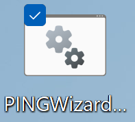
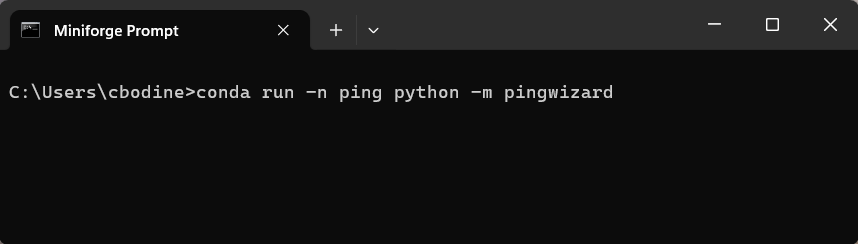

# PING Wizard
{: .no_toc }

Light-weight interface for running [PING Ecosystem](../PINGEcosystem.md) utilities.
{: .fs-6 .fw-300 }

[)](https://pypi.org/project/pingwizard/)

---

## Overview

{: .g2k }
> As of v4.0, [PINGWizard](https://github.com/CameronBodine/PINGWizard) is the recommended interface for running `PINGMapper` and other utilities in the [PING Ecosystem](../PINGEcosystem.md).

`PINGWizard` is a light-weight interface for launching `PINGMapper` utilities, including running the [tests](Testing.md), processing a [sonar log](./Running.md#process-single-sonar-log), batch process [multiple sonar logs](./Running.md#batch-process-multiple-sonar-recordings), and 


There are two options for launching PINGWizard: a) [with a shortcut](#option-a---shortcut) or b) [command prompt](#option-b---conda-command-prompt).

### Option A - Shortcut

During installation, you were prompted to select a location to save a batch (Windows) or bash (Linux/Mac OS) shortcut file. This file contains the commands to activate the `ping` conda environment and run PINGWizard. 

On Windows, simply double click the PINGWizard.bat file:



On Linux/Mac OS, open a command prompt, change directory to where you saved the shortcut, and launch the bash script by entering the following and press `Enter`:

```bash
./PINGWizard.sh
```


#### Option B - Conda Command Prompt

Open the Conda Command Prompt used during [installation](./Installation.md). Activate the `ping` environment and launching PINGWizard by entering the following and pressing `Enter`:

```bash
conda run -n ping python -m pingwizard
```



PINGWizard will launch and present a menu of buttons to run various PINGMapper utilities:


Press one of the buttons to:

- [Run PINGMapper](./Running.md) on a [single sonar log](./Running.md#process-single-sonar-log).
- [Run PINGMapper](./Running.md) on a [batch of sonar log.](./Running.md#batch-process-multiple-sonar-recordings).
- [Test PINGMapper](./Testing.md) on a [small dataset](./Testing.md#small-dataset-test) *Recommended if you just installed/updated PINGMapper*.
- [Test PINGMapper](./Testing.md) on a [large dataset](./Testing.md#large-dataset-test) *Recommended if you just installed/updated PINGMapper*.
- [Update PINGMapper](./UpdateInstallation.md) *Recommended to run routinely*.