# Use PINGMapper

{: .no_toc }

Find out how to process your own sonar recordings.
{: .fs-6 .fw-300 }

---

After [installing](./Installation.md) `PINGMapper` and running the [tests](./Testing.md), you are now ready to use `PINGMapper` on your own sonar logs. There are two options for processing sonar logs: 1) process a [single sonar log](#process-single-sonar-log) or 2) process a [batch of sonar logs](#batch-process-multiple-sonar-recordings) in a directory. Continue reading to find out how.

## Process single sonar log

### Note on sonar file structure

PINGMapper supports multiple sonar file formats:

| Format | Extension(s) | Compatible Systems |
|--------|-------------|-------------------|
| Humminbird&reg; | `.DAT` | All Humminbird&reg; side-imaging models |
| Lowrance&reg; | `.sl2`, `.sl3` | Lowrance&reg; side-imaging units |
| Garmin&reg; | `.RSD` | Garmin&reg; Panoptix / LiveScope systems |
| Cerulean&reg; | `.svlog` | Cerulean&reg; sonar systems |
| JSF | `.jsf` | EdgeTech&reg; and other JSF-compatible systems |
| XTF | `.xtf` | Triton&reg; and other XTF-compatible systems |

**Humminbird&reg; file structure:**  Sonar recordings consist of a `DAT` file and a commonly named subdirectory containing `SON` and `IDX` files:

```bash
ParentFolder
├── Rec00001.DAT
├── Rec00001
│   ├── B001.IDX
│   ├── B001.SON
│   ├── B002.IDX
│   ├── B002.SON
│   ├── B003.IDX
│   ├── B003.SON
│   ├── B004.IDX
│   └── B004.IDX
```


### Step 1

The first step is to launch `PING Wizard` - *[Click here to learn how](./PINGWizard.md).* This will open the `PING Wizard` window:

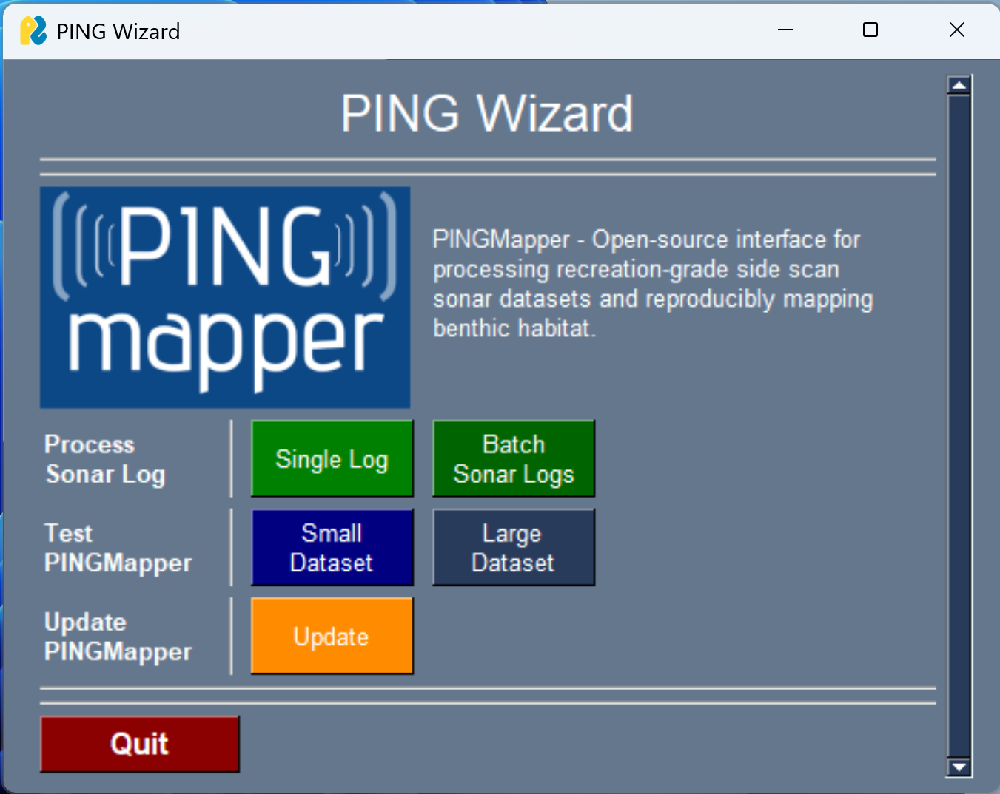


### Step 2

Press the `Single Log` button:

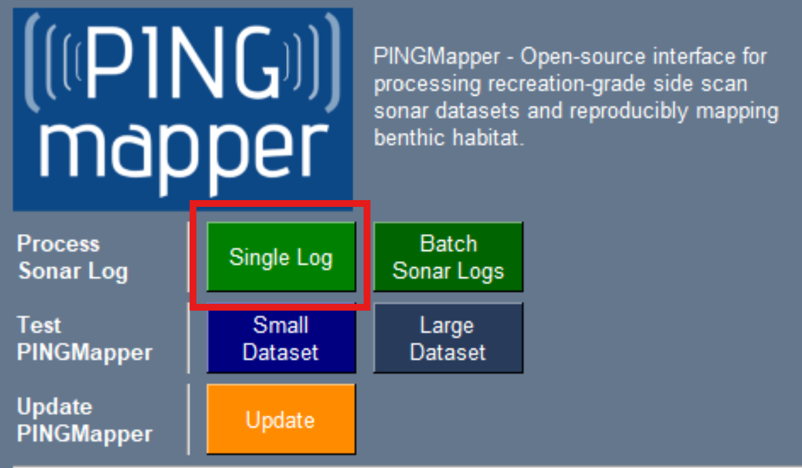

 This will open the `Process Sonar Log` window:

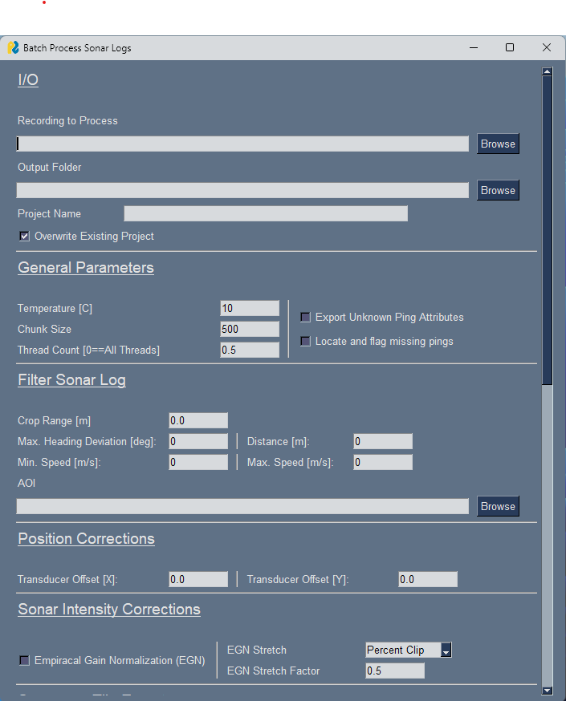

### Step 3
Selecting input/output directories, Project Name and whether to overwrite existing projects sharing the same name.

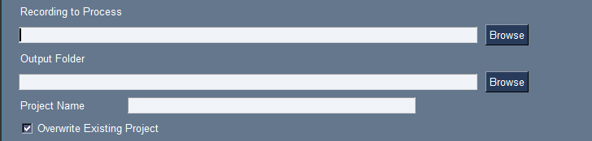

First, let's navigate to the `.DAT` file we want to process. For this example, we will just use the test recording shipped with `PING-Mapper`. Click the `Browse` button next to `Recording to Process` and a browse window will open:

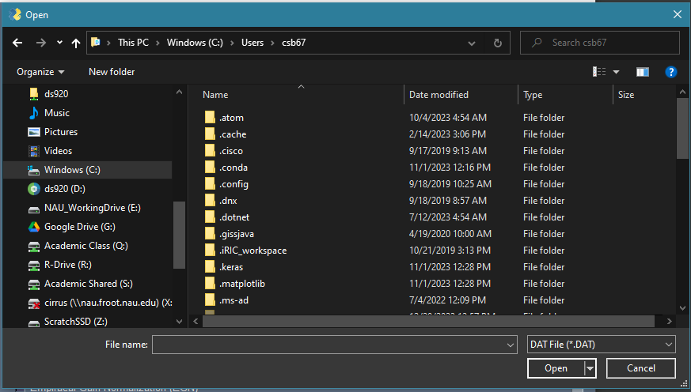

Navigate to the sonar log and select it. 

{: .g2k }
> Compatible with `.DAT` (Humminbird&reg;), `.sl2`/`.sl3` (Lowrance&reg;), `.RSD` (Garmin&reg;), `.svlog` (Cerulean&reg;), `.jsf` (JSF format), and `.xtf` (XTF format) sonar logs. See [Note on sonar file structure](#note-on-sonar-file-structure) for details. *Support for `.jsf` and `.xtf` added in v5.2.0.*


The name of the file will be visible in the `File name:` box, indicating it is selected:

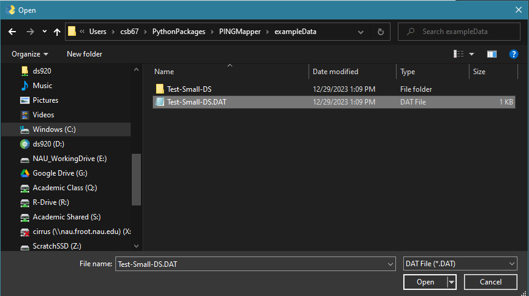

{: .g2k }
> As we [noted above](#note-on-sonar-file-structure), if processing Humminbird&reg; sonar logs, there should be a folder at the same location as the `.DAT` file with the same name. In the image above, we can see that there is a folder sharing the same name.

Now we can click `Open` on the window to select the sonar log. The window will close and we will see that the GUI has been populated with the path to the sonar log:

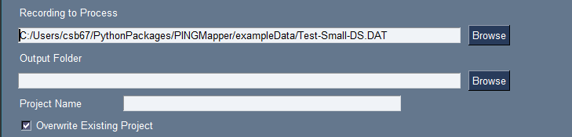

Follow the same process to select the `Output Folder` location. Supply a `Project Name` and a new folder with this name will be created in the `Output Folder`. Finally, specify whether to overwrite any existing project folders sharing the same name as the `Project Name`. Here is an example showing my selections:

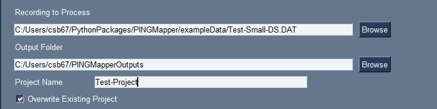

{: .warning }
> There have been issues with exporting datasets to cloud drives, specifically OneDrive (see [Issue 133](https://github.com/CameronBodine/PINGMapper/issues/133)). This may also be a problem for Google Drive. Please export datasets to a local folder instead.

### Step 4
Specify general processing parameters:

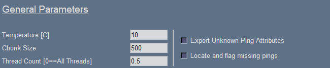

1. `Temperature [C]`: Update temperature (in Celsius) with average temperature during scan.

2. `Chunk Size`: Choose the number of pings to export per sonar tile. This can be any value but all testing has been performed on chunk sizes of 500.

3. `Thread Count`: Specify maximum number of CPU threads to use during processing:
    - `0.0 < Thread Count < 1.0`: Use this proportion of available CPU threads. `0.5 - 0.75` recommended to prevent OOM errors or freezing computer.
    - `0`: Use all available threads. This is the fastest your computer can process a sonar recording as the software will use all threads available on the CPU.

4. `Export Unknown Ping Attributes`: Option to export unknown ping metadata fields.

5. `Locate and flag missing pings`: Option to locate missing pings and fill with NoData. See [Issue #33](https://github.com/CameronBodine/PINGMapper/issues/33) and [this](https://cameronbodine.github.io/PINGMapper/docs/gettingstarted/Exports.html#orig_record_num) for more information. 


### Step 5

Options to filter (i.e. clip, remove, mask) data in sonar logs:

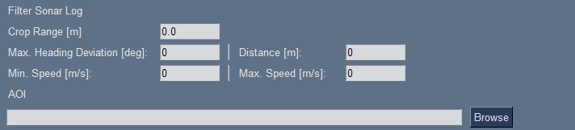

1. `Crop Range [m]`: Option to crop the max range extent [in meters].
    - `0` or `0.0`: Don't crop range.
    - `> 0`: Crop (e.g., don't process) sonar returns further than this range.

2. `Max. Heading Deviation [deg]` and `Distance [m]`: Filter sonar records based on maximum vessel heading over a given distance.
    - `0`: Don't filter
    - [See example](https://github.com/CameronBodine/PINGMapper/releases/tag/v2.1.0)

3. `Min. Speed [m/s]` and `Max. Speed [m/s]`: Filter sonar records based on minimum and/or maximum vessel speed.
    - `0`: Don't filter

4. `AOI`: Spatially filter sonar records based on polygon shapefile (.shp).
    - `C:/Path/To/The/AOI/aoi_boundary.shp`
    - Example: The pink polygon shapefile is used to clip the trackline, resulting in sonar mosaics for each transect.

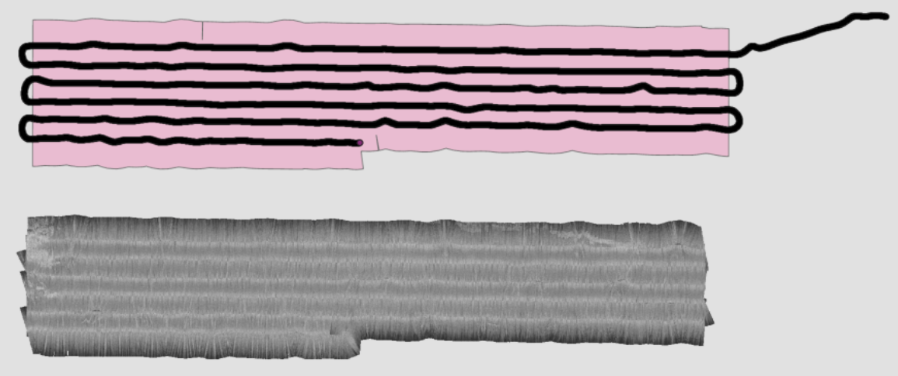

### Step 6
Provide an x and y offset (in meters) to account for position offset between the control head (or external GPS) and the transducer.

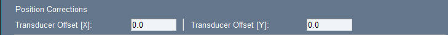

- Origin (0,0) is the location of control head (or external GPS)
-  X-axis runs from bow (fore, or front) to stern (aft, or rear) with positive offset towards the bow, negative towards stern
- Y-axis runs from portside (left) to starboard (right), with negative values towards the portside, positive towards starboard

Here is an example showing the transducer in relation to the control head. In this case, you would supply a positive `Transducer Offset [X]` AND a positive `Transducer Offset [Y]`.

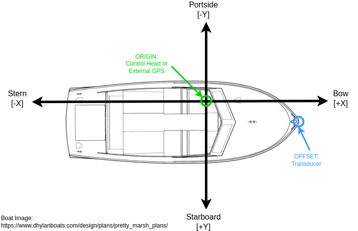

### Step 7
Decide if you want the sonar intensities to be corrected.

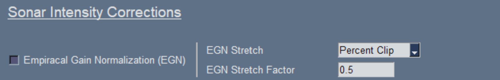

**Tone Controls** (applied before or independently of EGN):

1. `Tone Gamma [0.1–3.0]`: Apply gamma correction to mid-tone brightness.
    - `1.0`: No correction (default).
    - `< 1.0`: Brighten mid-tones.
    - `> 1.0`: Darken mid-tones.

2. `Tone Gain [0.0–3.0]`: Linear brightness multiplier applied to all intensities.
    - `1.0`: No correction (default).
    - `> 1.0`: Brighten overall intensity.
    - `< 1.0`: Darken overall intensity.

**Empirical Gain Normalization (EGN)**:

3. `Empirical Gain Normalization (EGN)`: Option to do Empirical Gain Normalization (EGN) to correct for sonar attenuation.

4. `EGN Stretch`: Specify how to stretch the pixel values after correction:
    - `None`: Do not apply stretch.
    - `Min-Max`: Stretch to global minimum and maximum.
    - `Percent Clip`: Do percent clip [Recommended]

5. `EGN Stretch Factor`
    - If `Percent Clip` is selected, the value supplied to `EGN Stretch Factor` specifies percent of the histogram tails to clip. This is similar to the [stretch function](https://desktop.arcgis.com/en/arcmap/latest/manage-data/raster-and-images/stretch-function.htm) provided by ArcGIS.

### Step 8
Configure global export options that apply to all image outputs.

1. `Export 16-bit TIFFs`: When checked, sonogram tiles and georectified imagery are exported as 16-bit grayscale TIFFs instead of 8-bit images. This preserves the full dynamic range of the sonar data and is recommended for quantitative analysis.
    - Requires `Image Format` (Step 9) to be set to `.tif`.

2. `Colormapped RGB uses 8-bit channels`: When a colormap is applied, the resulting RGB image uses 8-bit channels per channel (standard 24-bit color). Uncheck only if you need 16-bit color channels per channel (uncommon). Enabling this keeps file sizes smaller.

{: .g2k }
> *16-bit TIFF export was added in v5.2.0.*

### Step 9
Decide if raw (waterfall) sonograms should be exported.

{: .g2k }
> Check out the [Sonogram Tiles Tutorial](../tutorials/SonogramTiles.md) for a thorough breakdown of all the settings.

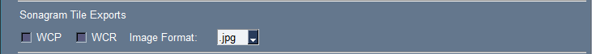

1. `WCP`: Export raw (waterfall) sonograms with the water column present.
2. `WCM`: Export raw (waterfall) sonograms with the water column masked.
3. `WCR`: Export raw (waterfall) sonograms with the water column removed and slant range corrected.
4. `WCO`: Export raw (waterfall) sonograms with the water column only.

5. `Speed Correct`: Create speed corrected (based on distance traveled) tiles.
6. `Mask Shadows`: Mask sonar shadows. *Shadow Removal must be selected [see Step 10](#step-10)*.
7. `Max Crop`: Crop to minimum depth and maximum range.
8. `Image Format`: Specify sonogram file type (`.png`, `.jpg`, or `.tif`). This applies to sonograms and plots. Use `.tif` when exporting 16-bit TIFFs (see [Step 8](#step-8)).
9. `Tile Colormap`: Apply colormap to sonogram. Any [Matplotlib colormap](https://matplotlib.org/stable/tutorials/colors/colormaps.html) can be used. If the colormap needs to be reversed, append `_r` to the colormap name.

{: .g2k }
> Check out the [Colormap Tutorial](../tutorials/Colormaps.md) for recommendations.

### Step 10
Update depth detection and shadow removal parameters as necessary:

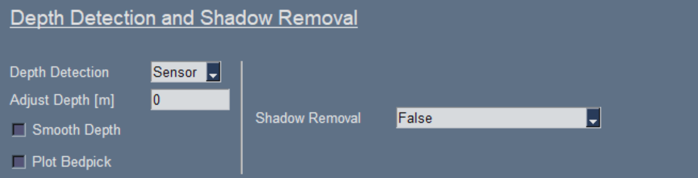


1. `Depth Detection`: Specify a depth detection method:
    - `Sensor`: Don't automatically estimate depth. Use sonar sensor depth instead.
    - `Auto`: Automatically segment and remove water column with a Residual U-Net, based upon [Zheng et al. 2021](https://www.mdpi.com/2072-4292/13/10/1945).

2. `Adjust Depth [m]`: Additional depth adjustment in meters for water column removal. Positive values increase depth estimate, resulting in a larger proportion of sonar returns being removed during water column removal.


3. `Smooth Depth`: Smooth the depth data before removing water column.  This may help with any strange issues or noisy depth data.

4. `Plot Bedpick`: Option to plot bedpick(s) on non-rectified sonogram for visual inspection.

5. `Shadow Removal`: Automatically segment and remove shadows from any image exports:
    - `False`: Don't segment or remove shadows.
    - `Remove all shadows`: Remove all shadows.
    - `Remove only bank shadows`: Remove only those shadows in the far-field. In a river, this is usually caused by the river bank.

### Step 11
Update georectification parameters as necessary:

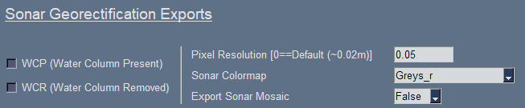

1. `WCP`: Export georectified sonar imagery with water column present.

2. `WCR`: Export georectified sonar imagery with water column removed and slant range corrected.

3. `Pixel Resolution`: Specify an output pixel resolution [in meters]:
    - `0`: Use default resolution [~0.02 m].
    - `> 0`: Resize mosaic to output pixel resolution.

4. `Sonar Colormap`: Apply colormap to rectified imagery. Any [Matplotlib colormap](https://matplotlib.org/stable/tutorials/colors/colormaps.html) can be used. If the colormap needs to be reversed, append `_r` to the colormap name.

5. `Export Sonar Mosaic`: Option to mosaic georectified sonar imagery. Options include:
    - `False`: Don't Mosaic.
    - `GTiff`: Export mosaic as GeoTiff.
    - `VRT`: Export mosaic as VRT (virtual raster).

6. `# Chunks per Mosaic [0==All Chunks]`: Limit mosaic to a subset of chunks.
    - `0`: Include all chunks in mosaic.
    - `> 0`: Use only this many chunks per mosaic (useful for very large recordings).

{: .g2k }
> You must check `WCP` and/or `WCR` in [Step 11](#step-11) in order to export sonar mosaics.

### Step 12
Update automated substrate mapping parameters as necessary:

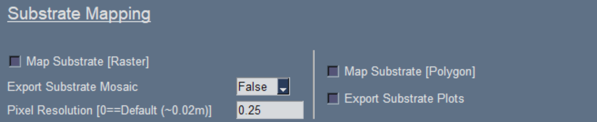

1. `Map Substrate [Raster]`: Export raster georectified substrate maps. Required to export maps as polygon shapefile.

2. `Export Substrate Mosaic`: Option to mosaic georectified substrate classification rasters. Options include:
    - `False`: Don't Mosaic.
    - `GTiff`: Export mosaic as GeoTiff.
    - `VRT`: Export mosaic as VRT (virtual raster).

{: .g2k }
> You must check `Map Substrate [Raster]` in [Step 12](#step-12) in order to export substrate mosaics.

3. `Pixel Resolution`: Specify an output pixel resolution [in meters]:
    - `0`: Use default resolution [~0.02 m].
    - `> 0`: Resize mosaic to output pixel resolution.

4. `Map Substrate [Polygon]`: Export polygon shapefile georectified substrate maps.

5. `Export Substrate Plots`: Option to export substrate plots.


### Step 13
Select miscellaneous exports:


1. `Banklines`: Export polygon shapefile which estimates river bankline location based on the shadow sementation.
    - [See Example](https://github.com/CameronBodine/PINGMapper/releases/tag/v2.1.0)

2. `Coverage`: Export polygon shapefile of sonar coverage and point shapefile of vessel track.


### Step 14
Buttons: 

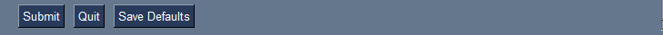

1. Click `Submit` to start processing.
2. Click `Quit` to exit without processing.
3. Click `Save Defaults` to save current parameter selections as default.


## Batch process multiple sonar recordings

PING-Mapper includes a script which will find all sonar recordings in a directory (even subdirectories!) and batch process them. This is useful if you have spent a day on the water collecting multiple sonar recordings. Just point this script at the top-most folder, provide an output directory for processed files, and PING-Mapper will do the rest!

### Note on sonar file structure

PINGMapper supports the same file formats in batch mode as in single-log mode. See the [Note on sonar file structure](#note-on-sonar-file-structure) above for the full list of supported formats and their directory structures.

For Humminbird&reg; recordings, the directory of saved recordings should have the following structure:

```
AllRecordings
├── Rec00001.DAT
│   ├── Rec00001
│   │   ├── B001.IDX
│   │   ├── B001.SON
│   │   ├── B002.IDX
│   │   ├── B002.SON
│   │   ├── B003.IDX
│   │   ├── B003.SON
│   │   ├── B004.IDX
│   │   └── B004.IDX
├── Rec00002.DAT
│   ├── Rec00002
│   │   ├── B001.IDX
│   │   ├── B001.SON
│   │   ├── B002.IDX
│   │   ├── B002.SON
│   │   ├── B003.IDX
│   │   ├── B003.SON
│   │   ├── B004.IDX
│   │   └── B004.IDX
....
```

In the example above, the top directory is `ParentDirectory`. This is the directory you will point the GUI at. The script will then iterate each sonar recording (e.g., `Rec00001`, `Rec00002`, etc.), process the recording and export files as specified in the GUI. The `Output Folder` will have a folder sharing the same name as the sonar recording (e.g., `Rec00001`, `Rec00002`, etc.).

### Step 1
The first step is to launch `PING Wizard` - *[Click here to learn how](./PINGWizard.md).* This will open the `PING Wizard` window:


### Step 2
Press the `Batch Sonar Logs` button:

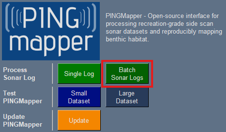


### Step 3

1. Provide the path to the `Parent Folder of Recordings to Process` by browsing to the appropriate location. In the example above, you would browse and select the `AllRecordings` folder.
2. Provide path to the `Output Folder` where all processed outputs will be saved.
3. Optionally provide a `Project Name Prefix` and/or `Project Name Suffix` to label output folders for this batch run.
4. `Preserve Input Subdirectory Structure`: When checked, the output folder will mirror the directory structure of the input folder. This is useful when recordings are organized into subfolders (e.g., by survey date or location).

{: .warning }
> There have been issues with exporting datasets to cloud drives, specifically OneDrive (see [Issue 133](https://github.com/CameronBodine/PINGMapper/issues/133)). This may also be a problem for Google Drive. Please export datasets to a local folder instead.

### Step 4
Enter all remaining process parameters as detailed [above](#step-4).