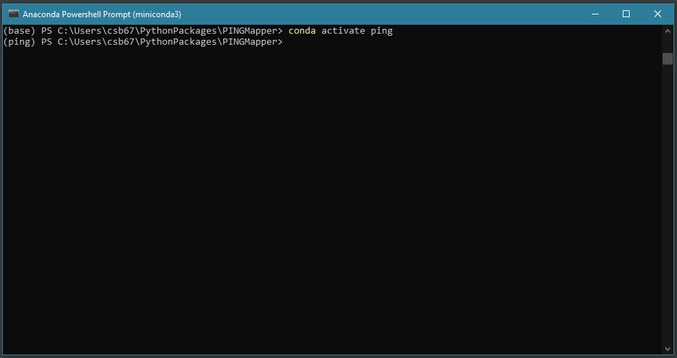
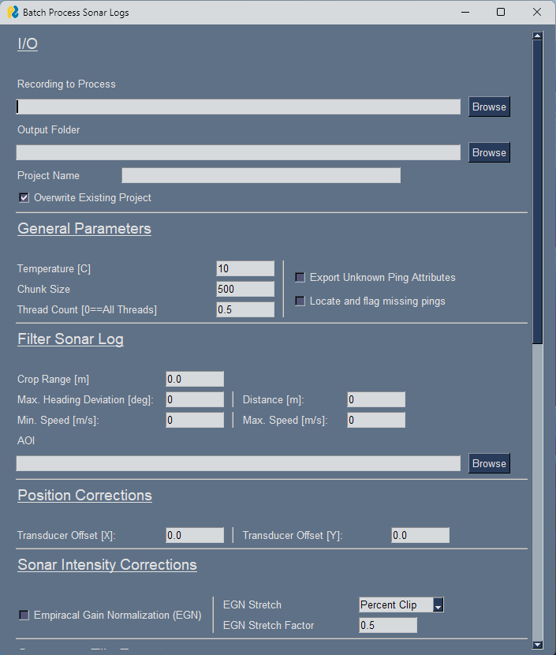
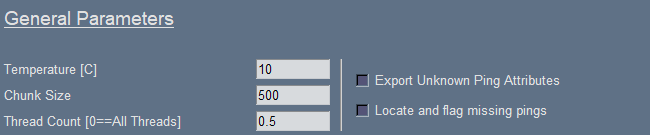
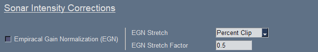
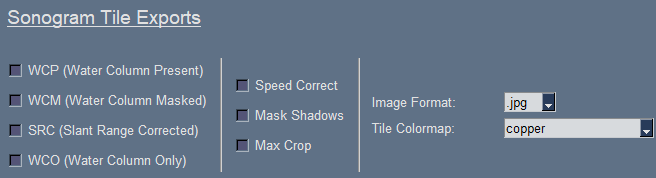
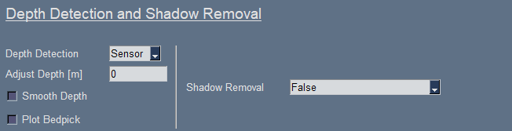

# Running `PING-Mapper`

{: .no_toc }

Find out how to process your own sonar recordings.
{: .fs-6 .fw-300 }

{: .g2k }
> If you prefer to run from a Python Script, check out the [Script Instructions](./Running_script.md)

After you have [tested](./Testing.md) `PING-Mapper` on the sample datasets, you are ready to process your own sonar recordings! Two scripts have been included with `PING-Mapper` and are found in the top-level directory. The first is `gui_main.py` which allows you to process a single sonar recording. It is recommended that you start with this script when first processing sonar recordings with the software. A second script called `gui_main_batchDirectory.py` provides an example of how to batch process many sonar recordings at once. Both approaches are covered below.

## Process single sonar recording

### Note on sonar file structure

Sonar recordings from Humminbird&reg; side imaging sonar systems are saved to a SD card inserted into the control head. Each sonar recording consists of a `DAT` file and commonly named subdirectory containing `SON` and `IDX` files.  The directory of saved recordings have the following structure:

```
Rec00001.DAT
├── Rec00001
│   ├── B001.IDX
│   ├── B001.SON
│   ├── B002.IDX
│   ├── B002.SON
│   ├── B003.IDX
│   ├── B003.SON
│   ├── B004.IDX
│   └── B004.IDX
```


### Step 1
1. Open the Anaconda Prompt (*Windows users: Anaconda Powershell Prompt is preferred*). Navigate to the `PINGMapper` directory using the `cd` command. Ensure your Anaconda prompt is in the top level of `PINGMapper` directory. For example:
```
cd C:\users\Cam\MyPythonRepos\PINGMapper
```

{: .g2k }
> Take a look at [Step 2](https://cameronbodine.github.io/PINGMapper/docs/gettingstarted/Installation.html#step-2) of the installation instructions if you need help navigating to the `PINGMapper` directory.

2. Activate the `ping` virtual environment by running the following command and hit `Enter`:
```
conda activate ping
```

You should see something similar to the following in the command prompt following by a flashing cursor:
```
(ping) PS C:\users\Cam\Python\PINGMapper>
```



### Step 2

Now we will run the GUI by issuing the following command and hitting `Enter`:

```
python gui_main.py
```


The GUI will launch in a new window:



The title at the top of the window that this GUI is designed to process a single sonar recording. More on batch processing a directory of sonar recordings [below](#batch-process-multiple-sonar-recordings). You will notice that there is a scroll bar on the right, allowing you to scroll through all of the parameters. At the very end, there are buttons to start processing the recording (`Submit`), close the window without processing (`Quit`), or to save the selected parameters as default (`Save Defaults`). More on all of this later. Lets step through each section of the GUI to learn how to process our recording.

### Step 3
Selecting input/output directories, Project Name and whether to overwrite existing projects sharing the same name.


First, let's navigate to the `.DAT` file we want to process. For this example, we will just use the test recording shipped with `PING-Mapper`. Click the `Browse` button next to `Recording to Process` and a browse window will open:


Navigate to the `.DAT` file and select it. The name of the `.DAT` file will be visible in the `File name:` box, indicating it is selected:


As we [noted above](#note-on-sonar-file-structure), there should be a folder at the same location as the `.DAT` file with the same name. In the image above, we can see that there is a folder sharing the same name. Now we can click `Open` on the window to select the `.DAT` file. The window will close and we will see that the GUI has been populated with the path to the `.DAT` file:


Follow the same process for deciding where the outputs should be exported to using the `Browse` button for selecting the `Output Folder` location. Supply a `Project Name` and a new folder with this name will be created there. Finally, specify whether to overwrite any existing project folders sharing the same name as the `Project Name`. Here is an example showing my selections:


Outputs from processing `Test-Small-DS.DAT` will be located in a newly created (or overwritten) folder called `Test-Project` at the following location: `C:/Users/csb67/PINGMapperOutputs`.

### Step 4
Specify general processing parameters:



1. `Temperature [C]`: Update temperature (in Celsius) with average temperature during scan.

2. `Chunk Size`: Choose the number of pings to export per sonar tile. This can be any value but all testing has been performed on chunk sizes of 500.

3. `Crop Range [m]`: Option to crop the max range extent [in meters].
    - `0` or `0.0`: Don't crop range.
    - `> 0`: Crop (e.g., don't process) sonar returns further than this range.

4. `Export Unknown Ping Attributes`: Option to export unknown ping metadata fields.

5. `Locate and flag missing pings`: Option to locate missing pings and fill with NoData. See [Issue #33](https://github.com/CameronBodine/PINGMapper/issues/33) and [this](https://cameronbodine.github.io/PINGMapper/docs/gettingstarted/Exports.html#orig_record_num) for more information.

6. `Thread Count`: Specify maximum number of CPU threads to use during processing:
    - `0`: Use all available threads. This is the fastest your computer can process a sonar recording as the software will use all threads available on the CPU.
    - `> 0`: Use specified number of threads.
    - `< 0`: Use total number of threads minus `Thread Count`.

### Step 5
Provide an x and y offset to account for position offset between the control head (or external GPS) and the transducer.


- Origin (0,0) is the location of control head (or external GPS)
-  X-axis runs from bow (fore, or front) to stern (aft, or rear) with positive offset towards the bow, negative towards stern
- Y-axis runs from portside (left) to starboard (right), with negative values towards the portside, positive towards starboard

Here is an example showing the transducer in relation to the control head. In this case, you would supply a positive `Transducer Offset [X]` AND a positive `Transducer Offset [Y]`.


### Step 6
Decide if you want the sonar intensities to be corrected.



1. `Empirical Gain Normalization (EGN)`: Option to do Empirical Gain Normalization (EGN) to correct for sonar attenuation.

2. `EGN Stretch`: Specify how to stretch the pixel values after correction:
    - `None`: Do not apply stretch.
    - `Min-Max`: Stretch to global minimum and maximum.
    - `Percent Clip`: Do percent clip [Recommended]

3. `EGN Stretch Factor``
    - If `Percent Clip` is selected, the value supplied to `EGN Stretch Factor` specifies percent of the histogram tails to clip. This is similar to the [stretch function](https://desktop.arcgis.com/en/arcmap/latest/manage-data/raster-and-images/stretch-function.htm) provided by ArcGIS.

### Step 7
Decide if un-rectified sonograms should be exported.



1. `WCP`: Export un-rectified sonograms with the water column present.
2. `WCR`: Export un-rectified sonograms with the water column removed.
3. `Image Format`: Specify sonogram file type (".png" or ".jpg"). This applies to sonograms and plots.

### Step 8
Decide if speed (or factor) corrected sonograms should be exported.


1. `Export Sonograms`: 
    - `0` or `False`: Don't export.
    - `True: Keep WC & Shadows`: Export images with water column and shadows *present*.
    - `True: Mask WC & Shadows`: Export images with water column and shadows *removed*.

2. `Speed Correction`: Specify if images should be speed corrected (based on distance traveled) or stretched by a factor:
    - `0`: No speed correction.
    - `1`: Speed correction based on distance traveled.
    - `!= 0 or 1`: Stretch along the track by the specified factor.

3. `Max Crop`: Perform ping-wise (`Checked`) or maximum range for a chunk as determined by shadow detection (`UnChecked`). See [this](https://cameronbodine.github.io/PINGMapper/docs/gettingstarted/Exports.html#speed-corrected) for more information:

### Step 9
Update depth detection and shadow removal parameters as necessary:



1. `Shadow Removal`: Automatically segment and remove shadows from any image exports:
    - `False`: Don't segment or remove shadows.
    - `Remove all shadows`: Remove all shadows.
    - `Remove only bank shadows`: Remove only those shadows in the far-field. In a river, this is usually caused by the river bank.


2. `Depth Detection`: Specify a depth detection method:
    - `Sensor`: Don't automatically estimate depth. Use sonar sensor depth instead.
    - `Auto`: Automatically segment and remove water column with a Residual U-Net, based upon [Zheng et al. 2021](https://www.mdpi.com/2072-4292/13/10/1945).


3. `Smooth Depth`: Smooth the depth data before removing water column.  This may help with any strange issues or noisy depth data.


4. `Adjust Depth [m]`: Additional depth adjustment in meters for water column removal. Positive values increase depth estimate, resulting in a larger proportion of sonar returns being removed during water column removal.


5. `Plot Bedpick`: Option to plot bedpick(s) on non-rectified sonogram for visual inspection.

### Step 10
Update georectification parameters as necessary:


1. `WCP`: Export georectified sonar imagery with water column present.

2. `WCR`: Export georectified sonar imagery with water column removed.

3. `Sonar Colormap`: Apply colormap to rectified imagery. Any [Matplotlib colormap](https://matplotlib.org/stable/tutorials/colors/colormaps.html) can be used. If the colormap needs to be reversed, append `_r` to the colormap name.

### Step 11
Update automated substrate mapping parameters as necessary:


1. `Predict Substrate`: Automatically predict substrates with provided deep learning segmentation model. Required in order to export substrate plots or maps.

2. `Export Substrate Plots`: Option to export substrate plots.

3. `Map Substrate [Raster]`: Export raster georectified substrate maps. Required to export maps as polygon shapefile.

4. `Map Substrate [Polygon]`: Export polygon shapefile georectified substrate maps.

5. `Classification Method`: There is currently only one substrate classification method.

### Step 12
Update mosaic export parameters as necessary:


1. `Pixel Size`: Specify an output pixel resolution [in meters]:
    - `0`: Use default resolution [~0.02 m].
    - `> 0`: Resize mosaic to output pixel resolution.

2. `# Chunks per Mosaic`: Optionally limit the number of chunks per mosaic:
    - `0`: Mosaic all chunks into single mosaic file.
    - `> 0`: Maximum number of chunks per mosaic file.

3. `Export Sonar Mosaic`: Option to mosaic georectified sonar imagery (exported from step 10). Options include:
    - `0` or `False`: Don't Mosaic.
    - `GTiff`: Export mosaic as GeoTiff.
    - `VRT`: Export mosaic as VRT (virtual raster).

4. `Export Substrate Mosaic`: Option to mosaic georectified substrate classification rasters (exported from step 11). Options include:
    - `0` or `False`: Don't Mosaic.
    - `GTiff`: Export mosaic as GeoTiff.
    - `VRT`: Export mosaic as VRT (virtual raster).

### Step 13
Select miscellaneous exports:


1. `Banklines`: Export polygon shapefile which estimates river bankline location based on the shadow sementation.


### Step 14
Buttons: 


1. Click `Submit` to start processing.
2. Click `Quit` to exit without processing.
3. Click `Save Defaults` to save current parameter selections as default.

## Batch process multiple sonar recordings

PING-Mapper includes a script which will find all sonar recordings in a directory (even subdirectories!) and batch process them. This is useful if you have spent a day on the water collecting multiple sonar recordings. Just point this script at the top-most folder, provide an output directory for processed files, and PING-Mapper will do the rest!

### Note on sonar file structure

Sonar recordings from Humminbird&reg; side imaging sonar systems are saved to a SD card inserted into the control head. Each sonar recording consists of a `DAT` file and commonly named subdirectory containing `SON` and `IDX` files.  The directory of saved recordings have the following structure, where `AllRecordings`:

```
AllRecordings
├── Rec00001.DAT
│   ├── Rec00001
│   │   ├── B001.IDX
│   │   ├── B001.SON
│   │   ├── B002.IDX
│   │   ├── B002.SON
│   │   ├── B003.IDX
│   │   ├── B003.SON
│   │   ├── B004.IDX
│   │   └── B004.IDX
├── Rec00002.DAT
│   ├── Rec00002
│   │   ├── B001.IDX
│   │   ├── B001.SON
│   │   ├── B002.IDX
│   │   ├── B002.SON
│   │   ├── B003.IDX
│   │   ├── B003.SON
│   │   ├── B004.IDX
│   │   └── B004.IDX
....
```

In the example above, the top directory is `AllRecordings`. This is the directory you will point the GUI at. The script will then iterate each sonar recording (e.g., `Rec00001`, `Rec00002`, etc.), process the recording and export files as specified in the GUI. The `Output Folder` will have a folder sharing the same name as the sonar recording (e.g., `Rec00001`, `Rec00002`, etc.).

### Step 1
From the command prompt, run the following to open the Batch GUI window:

```
python gui_main_batchDirectory.py
```

### Step 2

1. Provide the path to the `Parent Folder of Recordings to Process` by browsing to the appropriate location. In the example above, you would browse and select the `AllRecordings` folder.
2. Provide path to the `Output Folder` where all processed outputs will be saved.


### Step 3
Enter all remaining process parameters as detailed [above](#step-4)