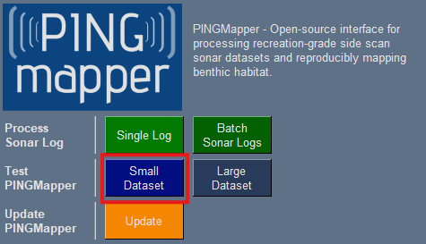

# Test PINGMapper
{: .no_toc }

Test PINGMapper on sample datasets.
{: .fs-6 .fw-300 }

---

Once you have [installed](./Installation.md) `PING-Mapper`, you can test the installation by processing two example datasets. The first is a [small](#small-dataset-test) dataset collected in Marble Canyon, AZ, USA. This is the fastest way to see if the software is performing as expected. A second test can be carried out on a [large](#large-dataset-test). The large dataset is included to see how the software performs on a typical sonar recording. 

## Small Dataset Test

### Step 1
The first step is to launch `PING Wizard` - *[Click here to learn how](./PINGWizard.md).* This will open the `PING Wizard` window:

### Step 2
Press the `Small Dataset` button:

### Step 3
Once complete, explore the outputs in the `Test-Small-DS` on your desktop `C:\User\ThisGuy\Desktop\Test-Small-DS` or in the base your user folder `C:\User\ThisGuy\Test-Small-DS`.

{: .warning }
> If you receive a `ModuleNotFoundError`, try the [troubleshooting steps](../faq.md/#modulenotfounderror)

{: .warning }
> If you receive an error, check the [FAQ](../faq.md). If the FAQ does not address your issue, please [submit a new issue](https://github.com/CameronBodine/PINGMapper/issues/new/choose). 
> 
> [Submit Issue](https://github.com/CameronBodine/PINGMapper/issues/new/choose){: .btn .btn-red }

## Large Dataset Test

### Step 1
The first step is to launch `PING Wizard` - *[Click here to learn how](./PINGWizard.md).* This will open the `PING Wizard` window:

### Step 2
Press the `Large Dataset` button:

### Step 3
Once complete, explore the outputs in the `Test-Large-DS` on your desktop `C:\User\ThisGuy\Desktop\Test-Large-DS` or in the base your user folder `C:\User\ThisGuy\Test-Large-DS`.

{: .warning }
> If you receive a `ModuleNotFoundError`, try the [troubleshooting steps](../faq.md/#modulenotfounderror)

{: .warning }
> If you receive an error, check the [FAQ](../faq.md). If the FAQ does not address your issue, please [submit a new issue](https://github.com/CameronBodine/PINGMapper/issues/new/choose). 
> 
> [Submit Issue](https://github.com/CameronBodine/PINGMapper/issues/new/choose){: .btn .btn-red }

## All Done!

You can now run `PINGMapper` on your [own datasets](./Running.md).
