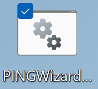
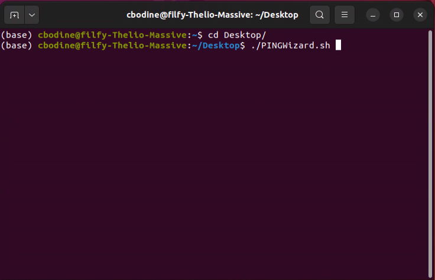
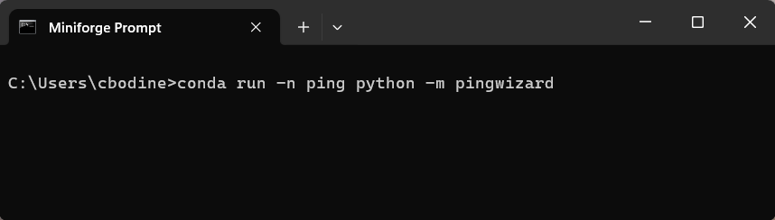

# Updating PINGMapper

{: .g2k }
> As of v4.0, the updating PINGMapper process has been dramatically improved and simplified compared to the [old version](./UpdateInstallation_v1.md)

{: .warning }
> If you have not installed PINGInstaller previously and used a version of PINGMapper < 4.0, you will want to follow the [installation](./Installation.md) instructions.

If you have installed a previous version of PING-Mapper (>=4.0), follow these instructions to update to the latest version.

## Option 1

Launch PINGWizard *([Click here to learn how](./PINGWizard.md))* and press `Update`. 


There are two ways to Launch PINGWizard.

### With Desktop Shortcut

During installation, a batch (Windows) or bash (Linux/Mac OS) file was saved to the desktop. This file contains the commands to activate the `ping` conda environment and run PINGWizard. 

On Windows, simply double click the PINGWizard.bat file on the desktop:



On Linux/Mac OS, open a command prompt, change directory to the Desktop, and launch the bash script by entering the following and press `Enter`:

```bash
cd Desktop
./PINGWizard.sh
```



### With Conda Command Prompt

Open the Conda Command Prompt used during [installation](./Installation.md). Activate the `ping` environment and launching PINGWizard by entering the following and pressing `Enter`:

```bash
conda run -n ping python -m pingwizard
```



## Option 2

Open the Anaconda Powershell prompt and run the following:
```bash
conda activate ping
python -m pinginstaller
```


## All Done!