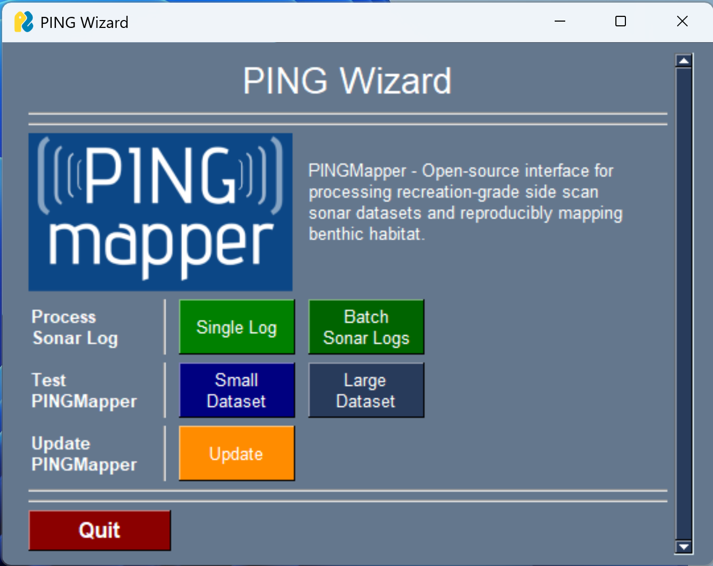

# Update PINGMapper
{: .no_toc }

Update `PINGMapper` & dependencies to the latest version.
{: .fs-6 .fw-300 }

[](https://pypi.org/project/pingmapper/) [](https://pypi.org/project/pingwizard/) [](https://pypi.org/project/pingverter/) [](https://pypi.org/project/pinginstaller/)

---

{: .g2k }
> As of v4.0, the updating PINGMapper process has been dramatically improved and simplified compared to the [old version](./UpdateInstallation_v1.md)

{: .warning }
> If you have not installed PINGInstaller previously and used a version of PINGMapper < 4.0, you will want to follow the [installation](./Installation.md) instructions.

If you have installed a previous version of PING-Mapper (>=4.0), follow these instructions to update to the latest version.

## Option 1

Launch PINGWizard *([Click here to learn how](./PINGWizard.md))*:



Press `Update`:


## Option 2

Open the Anaconda Powershell prompt and run the following:

```bash
conda activate ping
python -m pinginstaller
```

Alternatively run as a single command:

```base
cond run -n ping python -m pinginstaller
```

## All Done!

It is recommended that you [run the tests](./Testing.md) to make sure everything is working correctly.