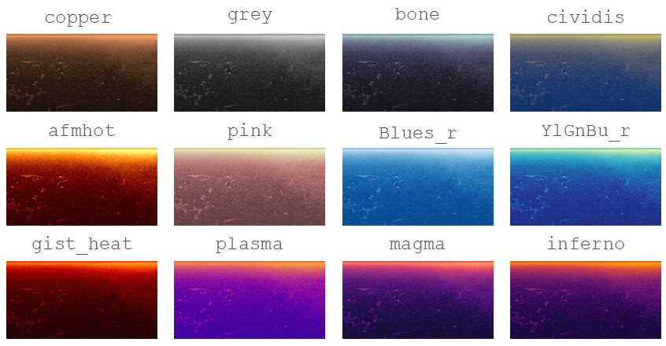

# Colormap Selection
{: .no_toc }

Use `matplotlib` colormaps to create beautiful sonar images.
{: .fs-6 .fw-300 }

---

## Overview

`PINGMapper` uses [Matplotlib colormap](https://matplotlib.org/stable/tutorials/colors/colormaps.html) to color sonar image exports. If the colormap needs to be reversed, append `_r` to the colormap name.

### Recommended Colormaps

Example of recommended colormaps. First row are highly recommended.

