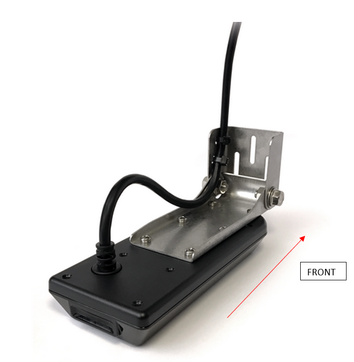

# Sonar Data Collection

## Materials
- Humminbird&reg; control head
- Humminbird&reg; transducer
- Humminbird&reg; power cable
- External GPS & PVC pipe (optional) 
- SD Card
- Metal pole
- Trolling motor mount
- Vessel

## Introduction

This is a simple guide to collecting side-scan sonar data. This guide is specifically focused on collecting imagery along a river channel, but much of the information is relevant for other systems. This was created a while ago and likely needs to be updated. But it should help you get started with collecting high-quality imagery. The guide is tailored to the Humminbird&reg; Helix G2N but should be similar for any other Humminbird&reg; system.

## Trandsducer
- The image below shows the proper orientation of the transducer. The front of the mounting bracket is the "front" of the transducer, as indicated by the arrow, with port side-scan channel oriented to the left and starboard side-scan channel oriented to the right.

- We recommend locating the transducer at the bow of the survey vessel. This is to limit any turbulance caused by the boat or the motor. Turbulance in the water will lower the quality of the imagery. The tansducer should be mounted to a pole. The pole can be connected to the bow on the gunnel using a [transom mount](https://www.trollingmotorshop.com/minn-kota-bracket-hinge-assembly-2991815a/) or something similar. The image below shows the pole-mounted transducer, transom mount, and an external Humminbird&reg; [GPS reciever](https://humminbird.johnsonoutdoors.com/us/shop/accessories/boat-navigation/ice-as-gps-hs-ice-gps-receiver-heading-sensor) (optional) connected to the pole. The GPS reciever is attached to a PVC pipe to buffer any effects the pole may have on the magnetic compass. If using a GPS reciever, ensure the arrow is oriented to the front of the vessel (direction of travel).

- Once the transducer set-up is attached to the vessel, make sure to orient the transducer so that it is horizontal to the surface of the water. Place the transducer 6-12 inches underwater. If the transducer must be mounted on the side, make sure it is low enough so that the hull isn’t blocking the signal (verify on the imagery screen)

## Control Head

- Insert an SD card into the control head. An SD card is required to save the recording.

- Connect power, GPS, and transducer cable to control head and power on the device.

{: .g2k }
> We found the wire cable collector made it so the power cable didn’t securely connect to the power head.  If you experience similar issues, remove wires from wire collector and connect each cable separately into the control head.

- The VIEW and EXIT buttons are used to move forward and backward, respectively, through the Humminbird&reg; views.  If you don’t see a View that you think you should, follow these directions:

{: .warning }
> In the past, we have noticed data loss when toggling through different views, particularly on the later generation models. This may be due to limits in the processing over-head available on the control head. A potential fix may be to turn off all views which are not needed, limiting the number of views the control head must process.

- Toggle through until you see the GPS Diagnostic view to make sure the Humminbird is receiving a signal from the External GPS. The image indicates the Internal GPS as the Source.  If attached, this should read External GPS.

- Toggle until you see the side scan screen.  While the transducer is in the water, you should see data appearing on the screen.  It will look strange until you the boat is moving.  Confirm that the control head is receiving a signal.

- While on this view, the “+” and “-“ buttons will change your range (displayed in top right and left of screen; 98 in the image above, resulting in 196 ft of total coverage)

- Use the Check mark button to change the frequency setting. This Helix has three possible settings with specific range thresholds:

    - MEGA (1150 – 1275 kHz) – up to 250 ft side to side (125 Left and 125 Right)
    - 800 kHz – up to 250 ft side to side (125 Left and 125 Right)
    - 400 kHz – up to 800 ft side to side (400 Left and 400 Right)

{: .g2k }
> Higher frequencies result in higher detail, but a decreased range potential. The high frequencies will also deteriorate if there is a lot of noise in the water column (air, turbidity, etc.). If the data quality is poor on the screen, try a lower frequency.

{: .warning }
> We do not recommend using the 800 kHz setting as this frequency has not produced high-quality imagery, in our experience.

## Begin Collecting Data

- Once ready to start collecting data, go to the Snapshot and Recording View screen:

- Follow these directions to start recording:

{: .note }
> You can be on any view while collecting data, but to ensure bank to bank coverage is being collected, change to the side scan view. Also, see the warning above about data loss while switching views.

{: .g2k }
> There should be a RECORDING notification that pops up every few seconds on the screen indicating that the data is being recorded.

## While Collecting Data

- For single pass, travel down center of channel while ensuring both banks are in view.  If both banks are in view, you will have darker portions (no data) along the edge of the screen.  If both banks are not in view, you will have sonar returns all the way to the edge of the screen.  Adjust range (while keeping frequency/range relationship in mind) until both banks are in view. The imnage below shows both banks along a river channel.

- In the image below, the left bank is not visible. A portion of the right bank in the middle is not visible.

{: .g2k }
> We recommend setting the range to a maximum extent of 120-150 feet per side (455 kHz) or 80-120 feet per side (MEGA) as this will result in high-quality imagery.

{: .note }
> Please refrain from changing the range frequently.  Try to keep about 80% of the screen filled with data.  This will allow for intermittent wider sections to be covered.  Don’t worry if you miss portions, it is bound to happen.  But if you notice that the river is getting wider and you haven’t seen the banks after a minute or so, go ahead and adjust the range.

- SPEED: 5 mph is optimum.  A range of 4 – 6.5 mph is acceptable.  Generally speaking, the boat will be in gear to get the prop spinning, but you won’t need much more throttle then that if traveling with the current. The boat will tend to slow down in the bends, due to eddy’s.

- TURNS/NAVIGATION: turns should be as smooth and slow as possible.  Avoid excessive turning.  This can result in the sonar sampling a location more than once, which can result in “phantom” objects: for example, the same boulder could be imaged twice, and rectified in two separate locations, resulting in two boulders in the imagery.

- If collecting data in open-water, straight overlapping transects are recommended.

{: .g2k }
> If collecting multiple transects, collect each transect as a seperate recording by stopping the recording at the end of a transect, turning the vessel, and start collecting a new recording for the next transect.

- Check the imagery frequently (multiple times in a minute) to ensure:

    - Bank to bank coverage
    - Distortions/fuzziness in the imagery (is vegetation stuck to the transducer?)
    - RECORDING popup is visible every few seconds
    - IMPORTANT: What you see on the screen is what is stored in the recording. If a target is not visible on the control head, it is not stored in the recording  Adjust range/frequency as required.

- Keep an eye out for obstacles and plan navigation around them accordingly.

## Once Survey is Complete

- Once data has been collected, hit menu and Stop Recording.  Recording is automatically saved to SD card.  

- POWER OUTAGE: if you lose power during the survey, the data is still intact, but corrupt. PING-Mapper should be able to decode the file. If not, please submit an [Issue](https://github.com/CameronBodine/PINGMapper/issues).

- Reference points during survey (i.e. for vegetation identification): if you want to use the Humminbird to collect reference GPS locations, for example locating different types of vegetation, you can hit the Mark button.  This will save a waypoint at that location.  Write down the waypoint id and whatever field notes on paper/spreadsheet.  You can also use another GPS for this.  

{: .note }
> Waypoints need to be exported to the SD card.  To do this, press Menu twice, navigate to diamond shape tab that says NAV.  Scroll down to export, select “Select All And..” and then select Save or Export or whatever it says.  Waypoints are now saved to the sd card.

