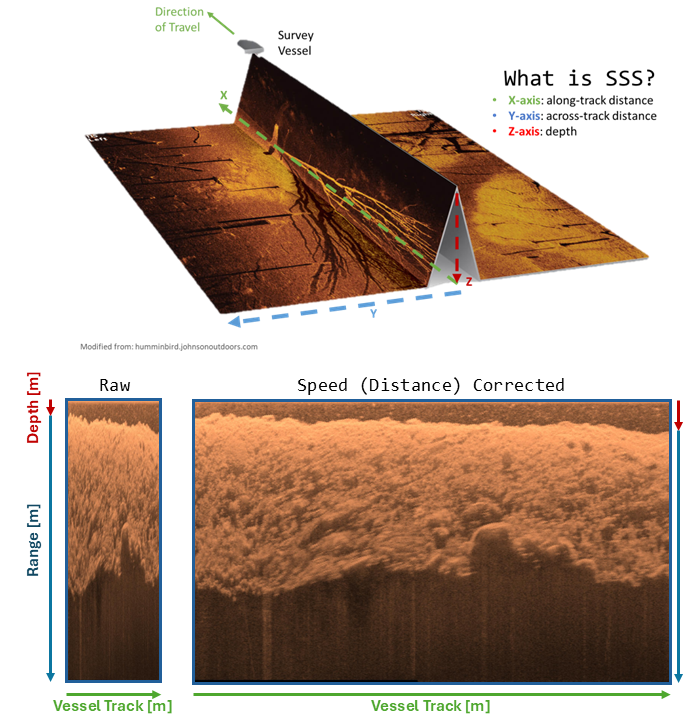
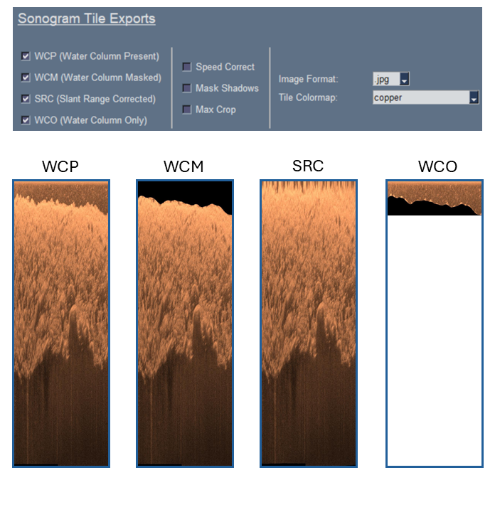
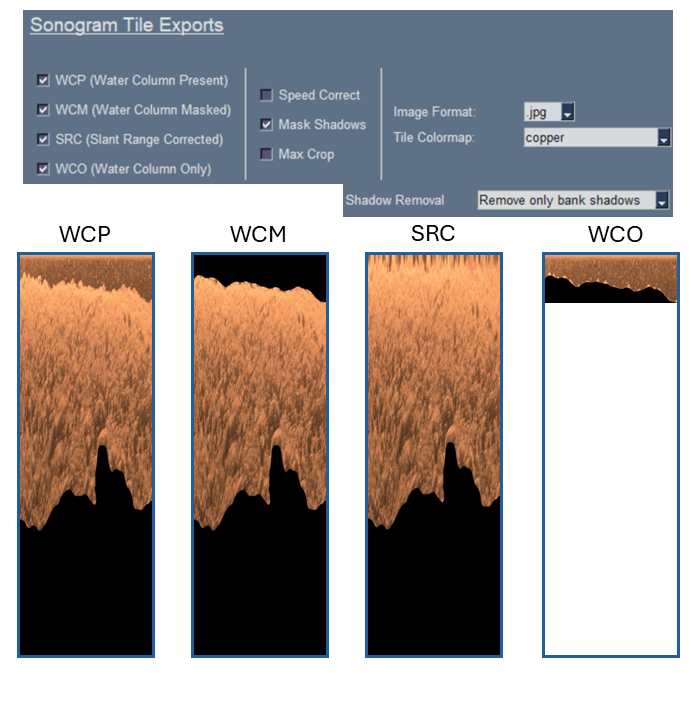
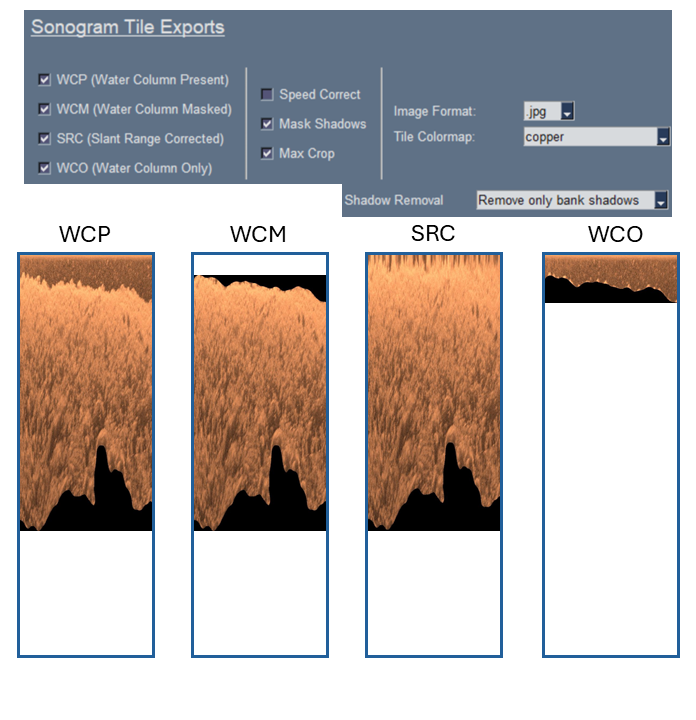
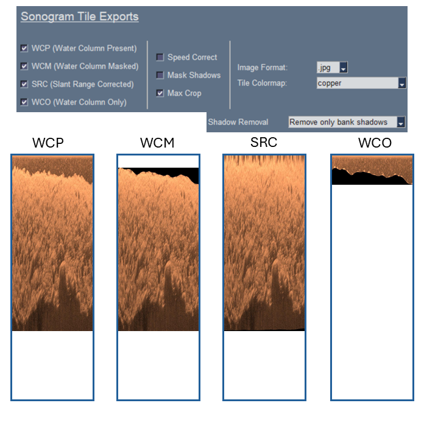
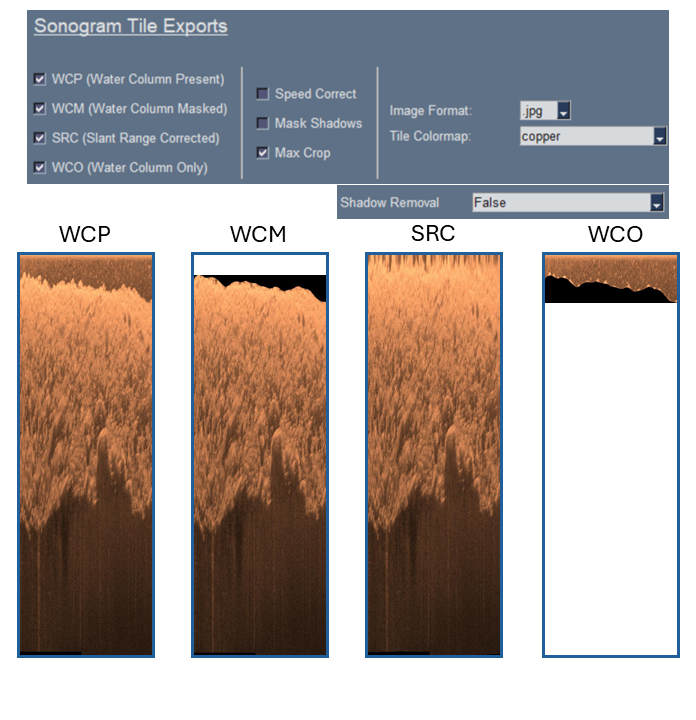
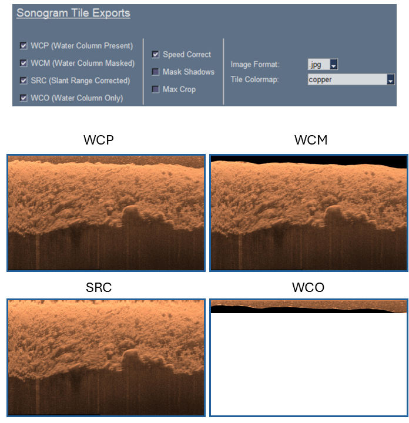
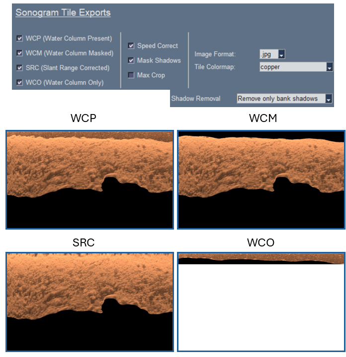
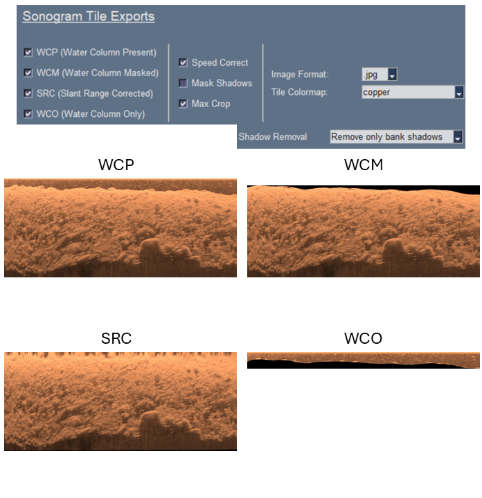
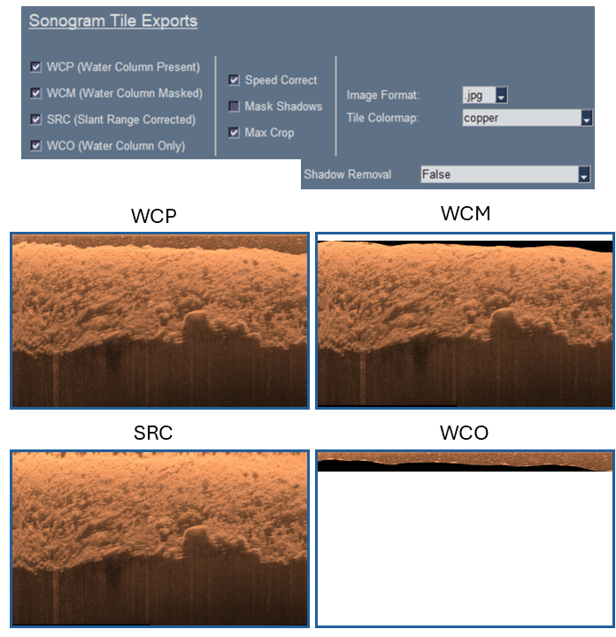

# Sonogram Tiles Tutorial
{: .no_toc }

Generate a variety of sonogram tiles for various use-cases.
{: .fs-6 .fw-300 }

---

  

    <- Click to expand table of contents
  

  {: .text-delta }
1. TOC
{:toc}

## Overview

Sonograms are 2-dimensional images similar to what you see while collecting data with your fishfinder. While collecting data, side-scan sonar imagery will beginning streaming on screen from top to bottom (right panel below). Single beam echosounder data (top left panel below) and downscan imagery (bottom left panel below) is also streamed, in this case, from right to left. This tutorial specifically covers *side-scan sonar*.

### Side-scan Sonar
What isn't immediately intuitive when examining raw 2-dimensional side-scan images is that there is actually 3 dimensions represented at different locations of the image. This includes (a) the portion of the water column at nadir directly beneath the boat (depth), (b) the portion of the seabed esonified by a side-scan sonar ping across the vessels track (range), and (c) the the along-track distance covered by the moving vessel. Successive pings from the side-scan sonar while the vessel is in motion allows the seabed to be imaged.

This "waterfall" of sonar data can be saved to a log by recording the data (see [Data Collection](./DataCollection.md) for more information). `PINGMapper` can be used to export sonar data from these logs to a variety of formats, including sonograms.

## Exporting Sonograms

`PINGMapper` can export four different types of side-scan sonograms:

1. `WCP`: Sonograms with the water column present;
2. `WCM`: Sonograms with the water column masked (removed);
3. `SRC`: Sonograms with the water column removed and slant range corrections applied;
4. `WCO`: Sonograms with the water column only.

These four sonograms can be exported as a `raw` (compressed) image or as a `speed corrected` image where the distance of the vessel is used to stretch the image horizontally so that feature dimensions can be accurately measured.The sonograms can be further customized by using three other settings in different combinations:

1. `Shadow Removal`: Use AI-models to automatically predict shadow regions; 
2. `Mask Shadows`: Use the shadow predictions to mask out shadows;
3. `Max Crop`: Crop out the masked water column and shadow regions.

The following sections show how each setting combination impacts the final sonograms.

### Raw

#### Mask Shadows

#### Mask Shadows - Crop

#### Crop - W/ Shadow Model

#### Crop - W/o Shadow Model

### Speed Corrected

#### Mask Shadows

#### Mask Shadows - Crop

#### Crop - W/ Shadow Model

#### Crop - W/o Shadow Model

## Case Studies

*coming soon: show simple case studies that might link to specific tutorials (??)*

### Data Quality Review

*coming soon*

### Target Identification

*coming soon*

#### Crab Pot

*coming soon*

#### Fish Enumeration

*coming soon*

#### SAV

*coming soon*

### Generate AI-Compliant Datasets

*coming soon*

#### Doodler

Sonograms can be labeled using an open-source software called [Doodler](https://github.com/Doodleverse/dash_doodler) (See [companion manuscript](https://doi.org/10.1029/2021EA002085)). `Doodler` is a "Human-In-The-Loop" machine learning tool for partially supervised image segmentation. 

The image below ([Figure 5 - Bodine, Buscombe, & Hocking (2024)](https://doi.org/10.1029/2024JH000135)) shows how substrates can be labeled on a sonogram tile. The sonogram is loaded into `Doodler`, classes are visually annotated with doodles, and the doodles are used to train a model to segment the remaining pixels. This is how the datasets used to train the substrate model in `PINGMapper` were generated.

#### Roboflow

*coming soon*