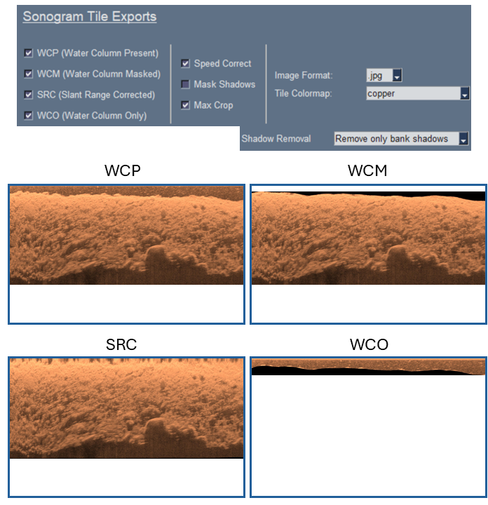

# Sonogram Tiles Tutorial
{: .no_toc }

Generate a variety of sonogram tiles for various use-cases.
{: .fs-6 .fw-300 }

---

  

    Table of contents
  

  {: .text-delta }
1. TOC
{:toc}

## Exporting Sonograms

### Raw

#### Mask Shadows

#### Mask Shadows - Crop

#### Crop - W/ Shadow Model

#### Crop - W/o Shadow Model

### Speed Corrected

#### Mask Shadows

#### Mask Shadows - Crop

#### Crop - W/ Shadow Model

#### Crop - W/o Shadow Model

## Case Studies

*coming soon: show simple case studies that might link to specific tutorials (??)*

### Data Quality Review

*coming soon*

### Target Identification

*coming soon*

#### Crab Pot

*coming soon*

#### Fish Enumeration

*coming soon*

#### SAV

*coming soon*

### Generate AI-Compliant Datasets

*coming soon*

#### Doodler

Sonograms can be labeled using an open-source software called [Doodler](https://github.com/Doodleverse/dash_doodler) (See [companion manuscript](https://doi.org/10.1029/2021EA002085)). Doodler is a "Human-In-The-Loop" machine learning tool for partially supervised image segmentation. 

The image below ([Figure 5 - Bodine, Buscombe, & Hocking (2024)](https://doi.org/10.1029/2024JH000135)) shows how substrates can be labeled on a sonogram tile. The sonogram is loaded into Doodler, classes are visually annotated with doodles, and the doodles are used to train a model to segment the remaining pixels. This is how the datasets used to train the substrate model in `PINGMapper` were generated.

#### Roboflow

*coming soon*