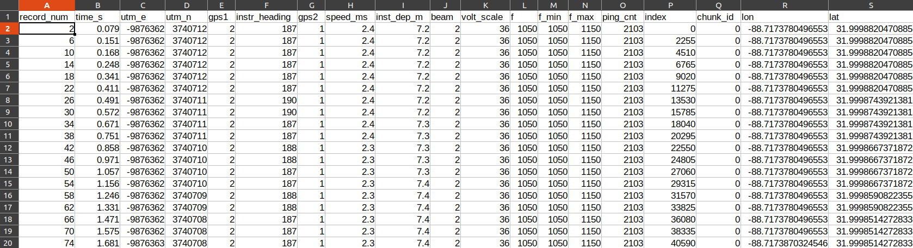

# PING-Mapper
{: .fs-9 }

`PING-Mapper` is an open-source software for reading and processing recreation-grade side scan sonar recordings
{: .fs-6 .fw-300 }

[Get started now](./docs/gettingstarted/gettingstarted.md){: .btn .btn-primary .fs-5 .mb-4 .mb-md-0 .mr-2 } [View it on GitHub](https://github.com/CameronBodine/PINGMapper){: .btn .fs-5 .mb-4 .mb-md-0 }

---

`PING-Mapper` transforms recreation-grade sonar systems into scientific data collectors, allowing researchers and citizens alike to reproducibly map their aquatic system with minimal expertise in data processing.

## Compatible Sonar Systems

`PING-Mapper` is currently compatible with Humminbird&reg; side imaging sonar systems. The software has been designed to work with any model, but has been specifically tested with the following models:

- 998
- 1198
- 1199
- Helix
- Solix
- Onix

If 'PING-Mapper' doesn't work for your Humminbird&reg; recording, submit an [Issue](https://github.com/CameronBodine/PINGMapper/issues).  For more information on Humminbird&reg; recording file formats, [read the docs](./docs/advanced/HumFileStructure.md).

## Overview

'PING-Mapper' can be run from a simple GUI with 'python gui_main.py' or from a stand-alone script with 'python main.py'. For batch processing multiply recordings, specify 'python gui_main_batchDirectory.py' or 'python main_batchDirectory.py'. 'PING-Mapper' provides the following functionality:

- Export all metadata from .DAT and .SON files to .CSV.

- Automatically detect depth (i.e. [Zheng et al. 2021](https://www.mdpi.com/2072-4292/13/10/1945)) and shadows in side scan channels .

- Correct sonar backscatter with Empiracle Gain Normalization.

- Export un-rectified sonar tiles with water column present (WCP) AND/OR export un-rectified sonograms with water column removed (WCR) using Humminbird depth estimates OR automated depth detections.

- Export speed corrected un-rectified sonograms.

- Smooth and interpolate GPS track points.

- Export georectified WCP (spatially inaccurate due to presence of water column) AND/OR WCR sonar imagery for use in GIS w/wo shadows removed.

- Mosaic georectified sonar imagery.

- Automatically segment and classify substrate patches.

More information on PING-Mapper exports can be found [here](./docs/gettingstarted/Exports.html).

## Examples

`PING-Mapper` is designed to **decode sonar recordings** from a Humminbird&reg; like this:


*Video made with [HumViewer](https://humviewer.cm-johansen.dk/)*

Export **ping attributes** from each sonar channel including sonar depth, latitude, longitude, vessel speed & heading, etc., to file for further analysis:



And create georectified mosaics of the sonar imagery and automatically generate substrate maps:


## Find out more!

There are several ways you can find out more about `PING-Mapper`. The first of which is this website! You can also check out the manuscripts and Zenodo archives below. If you use 'PING-Mapper' for your work, please cite the journal articles below.


### PING-Mapper v2.0.0
The second version of PING-Mapper is available now. Scientific articles documenting the new functionality will be posted here when available. Check the [release notes](https://github.com/CameronBodine/PINGMapper/releases/tag/v2.0.0) for more information.

#### Code
[](https://doi.org/10.5281/zenodo.10120054)

#### Segmentation models
[](https://doi.org/10.5281/zenodo.10093642)

#### Segmentation model training datasets
[](https://doi.org/10.5281/zenodo.10119320)


### PING-Mapper v1.0.0
An overview of PING-Mapper v1.0.0 functionality and justification are published in AGU's Earth and Space Science scientific journal. If you use PING-Mapper for your work, please cite the article!

#### Journal Article
Bodine, C. S., Buscombe, D., Best, R. J., Redner, J. A., & Kaeser, A. J. (2022). PING-Mapper: Open-source software for automated benthic imaging and mapping using recreation-grade sonar. Earth and Space Science, 9, e2022EA002469. [https://doi.org/10.1029/2022EA002469](https://doi.org/10.1029/2022EA002469)

#### Preprint
[](https://doi.org/10.31223/X5XP8Q)

#### Code
[](https://doi.org/10.5281/zenodo.6604785)

## Ready to get started?

Follow the installation and testing instructions to [Get Started!](./docs/gettingstarted/gettingstarted.md)


<!-- ## Welcome to GitHub Pages

You can use the [editor on GitHub](https://github.com/CameronBodine/PINGMapper/edit/gh-pages/index.md) to maintain and preview the content for your website in Markdown files.

Whenever you commit to this repository, GitHub Pages will run [Jekyll](https://jekyllrb.com/) to rebuild the pages in your site, from the content in your Markdown files.

### Markdown

Markdown is a lightweight and easy-to-use syntax for styling your writing. It includes conventions for

```markdown
Syntax highlighted code block

# Header 1
## Header 2
### Header 3

- Bulleted
- List

1. Numbered
2. List

**Bold** and _Italic_ and `Code` text

[Link](url) and 
```

For more details see [Basic writing and formatting syntax](https://docs.github.com/en/github/writing-on-github/getting-started-with-writing-and-formatting-on-github/basic-writing-and-formatting-syntax).

### Jekyll Themes

Your Pages site will use the layout and styles from the Jekyll theme you have selected in your [repository settings](https://github.com/CameronBodine/PINGMapper/settings/pages). The name of this theme is saved in the Jekyll `_config.yml` configuration file.

### Support or Contact

Having trouble with Pages? Check out our [documentation](https://docs.github.com/categories/github-pages-basics/) or [contact support](https://support.github.com/contact) and we’ll help you sort it out.
 -->
