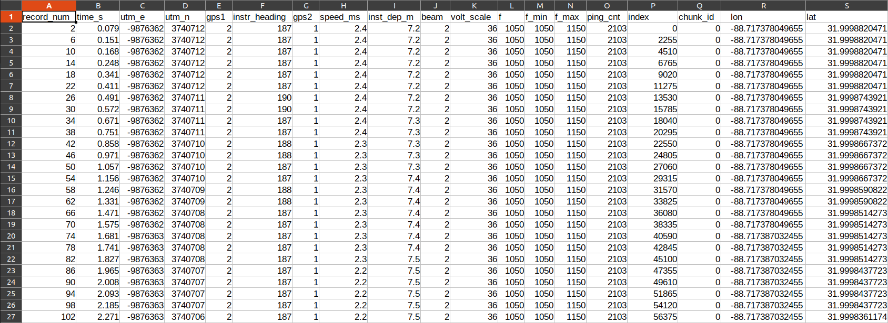

# PING-Mapper
{: .fs-9 }

`PING-Mapper` is an open-source software for reading and processing recreation-grade side scan sonar recordings
{: .fs-6 .fw-300 }

[Get started now](/docs/gettingstarted/gettingstarted.md){: .btn .btn-primary .fs-5 .mb-4 .mb-md-0 .mr-2 } [View it on GitHub](https://github.com/CameronBodine/PINGMapper){: .btn .fs-5 .mb-4 .mb-md-0 }

---

`PING-Mapper` turns recreation-grade sonar systems into scientific data collectors, allowing researchers and citizens alike to reproducibly map their aquatic system with minimal expertise in data processing. 

## Compatible Sonar Systems

`PING-Mapper` is currently compatible with Humminbird® side imaging sonar systems. The software has been designed to work with any model, but has been specifically tested with the following models:

- 998
- 1198
- 1199
- Helix
- Solix
- Onix

## Current Features

- Decode Humminbird® side imaging sonar recordings from any model;
- Export ping attributes (depth, latitude, longitude, vessel speed & heading, etc.) from every sonar channel;
- Water column removal using the sonar depth;
- Export of sonogram tiles and georectified mosaics.

## Examples

`PING-Mapper` is designed to **decode sonar recordings** from a Humminbird® like this:


*Video made with [HumViewer](https://humviewer.cm-johansen.dk/)*

Export **ping attributes** from each sonar channel including sonar depth, latitude, longitude, vessel speed & heading, etc., to file for further analysis:



And create georectified mosaics of the sonar imagery:


## Future Features

`PING-Mapper` is actively maintained, with new functionality currently in development. New functionality in the pipeline includes:

- Automatic depth detection
- Automatic substrate classification
- Imagery corrections (radiometric, attenuation, etc.)
- GUI front-end, either as standalone software, or QGIS plugin
- So much more...

## Find out more!

There are several ways you can find out more about `PING-Mapper`. The first of which is this website! You can also check out the [scientific paper](#paper) and the [code that made the paper](#code-that-made-the-paper).


## Paper
[](https://doi.org/10.31223/X5XP8Q)

*Peer Reviewed: Forthcoming...*

### Citation
If you use `PING-Mapper` for your work, please cite the paper:

Bodine, C. S., Buscombe, D., Best, R. J., Redner, J. A., Kaeser, A. J. (2022). *PING-Mapper: open-source software for automated benthic imaging and mapping using recreation-grade sonar.* Manuscript submitted to *Earth and Space Science*.


## Code that made the paper
[](https://doi.org/10.5281/zenodo.6604785)


<!-- ## Welcome to GitHub Pages

You can use the [editor on GitHub](https://github.com/CameronBodine/PINGMapper/edit/gh-pages/index.md) to maintain and preview the content for your website in Markdown files.

Whenever you commit to this repository, GitHub Pages will run [Jekyll](https://jekyllrb.com/) to rebuild the pages in your site, from the content in your Markdown files.

### Markdown

Markdown is a lightweight and easy-to-use syntax for styling your writing. It includes conventions for

```markdown
Syntax highlighted code block

# Header 1
## Header 2
### Header 3

- Bulleted
- List

1. Numbered
2. List

**Bold** and _Italic_ and `Code` text

[Link](url) and 
```

For more details see [Basic writing and formatting syntax](https://docs.github.com/en/github/writing-on-github/getting-started-with-writing-and-formatting-on-github/basic-writing-and-formatting-syntax).

### Jekyll Themes

Your Pages site will use the layout and styles from the Jekyll theme you have selected in your [repository settings](https://github.com/CameronBodine/PINGMapper/settings/pages). The name of this theme is saved in the Jekyll `_config.yml` configuration file.

### Support or Contact

Having trouble with Pages? Check out our [documentation](https://docs.github.com/categories/github-pages-basics/) or [contact support](https://support.github.com/contact) and we’ll help you sort it out.
 -->
